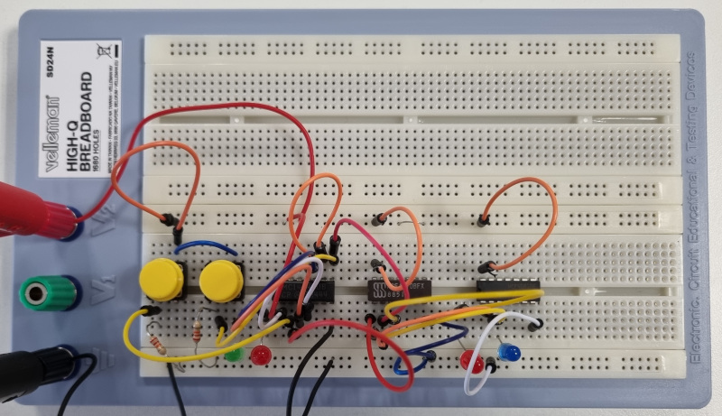
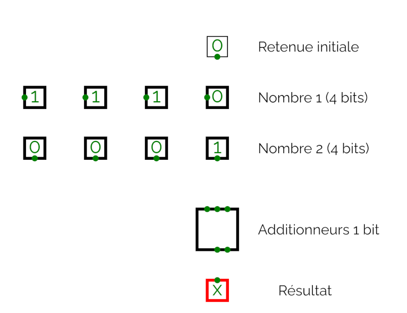
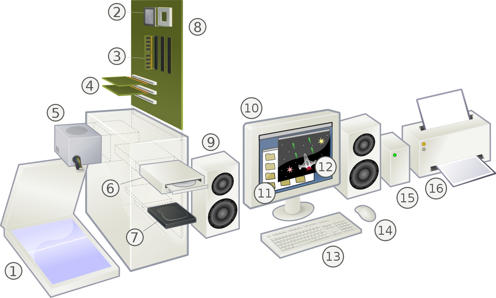
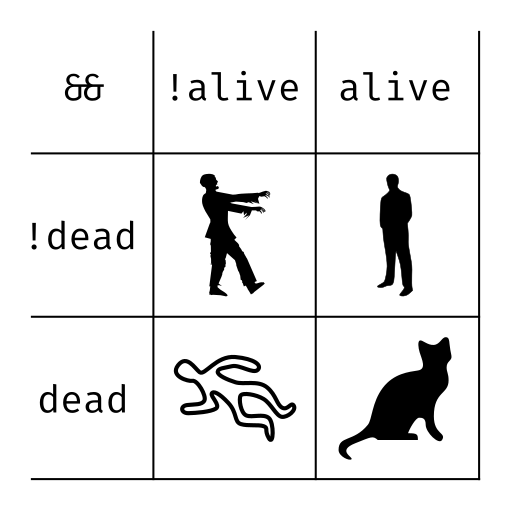




 


{{ titre_chapitre(num,titre,theme,niveau)}}
 
## Activités 

{{ titre_activite("Composants d'un ordinateur",[],0) }}

> Dans cette activité on démonte un ordinateur pour en extraire les composants et les reconnaître.

{{ titre_activite("Architecture de Von Neumann",[]) }}

<div class="centre"><iframe width="560" height="315" src="https://www.youtube.com/embed/c9pL_3tTW2c?start=2353" title="YouTube video player" frameborder="0" allow="accelerometer; autoplay; clipboard-write; encrypted-media; gyroscope; picture-in-picture" allowfullscreen></iframe></div>
En utilisant la video ci-dessus et en faisant éventuellement vos propres recherches sur le *Web*, répondre brièvement aux questions suivantes :

1. En quelle année a été conçu le modèle de Von Neumann ? 
2. Quels sont les différentes parties d'un ordinateur dans le modèle de Von Neumman ?
3. A quels composants d'un ordinateur correspondent ces différentes parties ?

{{ titre_activite("Circuit logique",[]) }}

{: .centre}
Les entrées du circuit sont les boutons jaunes à gauche et les sorties sont les led (la rouge et la bleue) situées à droite.

1. Observation d'un circuit logique
    3. Quelles sont les valeurs possibles d'une entrée ou d'une sortie ?
    4. Recopier et compléter le tableau suivant qui donne les valeurs des sorties en fonction des entrées :

        | $e_1$ | $e_2$ |  $s_1$ | $s_2$ |
        |----|----|----|----|
        | 0  | 0  | 0  |  ...  |
        | 0  | 1  | ...  |  ...  | 
        |  ...  |   ... |  ...  |  ...  | 
        |  ...  |   ... |  ...  |  ...  | 

        Ce tableau s'appelle la **table de vérité** du circuit.

2. Déduire des observations précédentes le rôle de ce circuit logique.

{{ titre_activite("Simulation d'un circuit logique",[]) }}

On utilisera le simulateur en ligne [circuitverse](http://circuitverse.org){target=_blank}

1. Aller sur le site de [circuitverse](http://circuitverse.org){target=_blank}, puis cliquer sur le lien **Simulator** en haut à droite. L'interface est représentée ci-dessous :
{: .centre}
    * le menu de gauche permettra de placer divers éléments d'un circuit,
    * le schéma du circuit apparaît dans la partie centrale,
    * à droite se trouve une boîte permettant de modifier les options des éléments du circuit.

2. Placer deux entrées (input), une porte logique `and` et une sortie (output) comme ci-dessous. Cliquer sur les entrées afin de les faire varier et dresser la table de vérité de ce circuit.
{: .centre}

3. De même construire un circuit pour tester la porter `or` puis la porte `not` (une seule entrée) et donner leur table de vérité.

4.  Le but de cette partie est de construire un additionneur 4 bits.

    1. Placer les 4 bits du premier nombre ainsi que les 4 bits du second nombre (voir ci-dessous). La première retenue de l'addition valant forcément 0, utiliser une entrée constante et valant 0 pour la matérialiser.
    {: .centre}

    2. Dans le menu "Misc", vous trouverez le circuit d'un additionneur 1 bit tel que celui rencontré dans l'activité précédente. Le placer afin d'additionner les deux bits les plus à droite et placer le résultat de la somme en dessous comme dans une addition traditionnelle à la main. Relier correctement votre circuit et le tester.
    {: .centre}

    3. Poursuivre la réalisation du circuit en ajoutant les additionneurs pour les autres bits.

        !!! Aide
            Attention à bien relier la sortie de l'addition des deux bits précédents `Cout` à la retenue de l'addition suivante `Cin`
    
    4. Vérifier sur les exemples suivants que votre circuit donne les bons résultats :
    * 0100 + 0101 = 1001 (c'est à dire 4 + 5 = 9)
    * 0111 + 0011 = 1010 (c'est à dire 7 + 3 = 10) 

    !!! Lien "Pour aller plus loin"
        On peut inclure l'affichage digital des nombres en base 10 comme sur une calculatrice, chacun des nombres à additionner est sur 4 bits, pour les afficher utiliser un `HexDisplay` (menu Output). Attention cependant pour regrouper les 4 bits d'un nombre utiliser un `Splitter` dans le menu Misc, il permet de regrouper une entrée de 4 bits en une seule entrée comme demandé par l'afficher hexadécimal. Pour créer le Splitter, entrer 4 comme *bitWidth*, puis "1 1 1 1" comme *bitWidth Split*.


{{ titre_activite("Un peu de langage machine",[]) }}

Dans cette partie, on utilise un outil en ligne permettant de visualiser le fonctionnement d'un ordinateur. Cet outil a été crée par Peter Higginson et  vous le trouverez sur [cette page](http://www.peterhigginson.co.uk/RISC/){target=_blank}.

1. Reconnaître les différentes parties de l'architecture de Von Neumman dans le schéma.
2. Dans le menu `Select` choisir le programme `add` qui effectue l'addition de deux nombres. Ce programme s'affiche alors en langage machine dans la partie supérieur droite du navigateur :

    ```dasm16
        INP R0,2
        INP R1,2
        ADD R2,R1,R0
        OUT R2,4
        HLT
    ```
    Le langage assembleur n'est qu'une traduction en terme mnémotechnique d'instructions simples compréhensible par le processeur comme par exemple ici `INP R0,2` qui signifie "*range dans le registre 0 le nombre saisi au clavier*".

3. Exécuter (en vitesse lente) le programme de façon à voir le fonctionnement du simulateur
4. Modifier ce programme de façon à additionner 3 nombres entrés au clavier
 
## Cours

{{ aff_cours(num) }}


## QCM

{{qcm_chapitre(num)}}


## Exercices

{{ exo("Parties d'un ordinateur",[],0) }}

 {: .centre}
 (Illustration CC BY-SA 3.0 <http://creativecommons.org/licenses/by-sa/3.0/>, via Wikimedia Commons)

1. Nommer les différentes parties d'un ordinateur visualisées ci-dessus.
2. Citer un composant qui est un périphérique d'entrée.
3. Citer un composant qui est un périphérique de sortie.

{{ exo("Modèle de Von Neumann",[]) }}
1. Citer les différentes parties d'un ordinateur dans le modèle de Von Neumann.
2. Que signifie {{sc("ual")}}, quel est son rôle ?
3. Dans les ordinateurs actuels, dans quel composant se trouve l'{{sc("ual")}} ?

{{ exo("Toujours vrai ou toujours faux !",[]) }}
1. Dresser la table de vérité de l'expression `a or (not a)`.
2. Même question pour `a and (not a)`.

{{ exo("Tables de vérités !",[]) }}
1. Faire la table de vérité de l'expression `not(a or b)`.
2. Même question pour l'expression `(not a) and (not b)`.
3. Que peut-on en déduire ?

{{ exo("Ordre des opérations",[]) }}

1. Faire la table de vérité de l'expression `(a or b) and c`.

    !!! Aide
        On peut dans un premier temps faire la table de vérité à la main puis vérifier les résultats en simulant le circuit sur [circuitverse](http://circuitverse.org){target=_blank}.

2. Même question pour l'expression `a or (b and c)`.
3. Les parenthèses sont-elles utiles dans l'écriture des expressions précédentes ? Justifier.


{{ exo("Additionneur un bit",[])}}
 1. En vous aidant éventuellement du cours ou du site [circuitverse](http://circuitverse.org){target=_blank} identifier les portes logiques du circuit suivant :
 {: .centre}
 2. Faire la table de vérité de ce circuit.
 3. En construisant ce circuit sur [circuitverse](http://circuitverse.org){target=_blank}, vérifier vos réponses à la question précédente.
 4. Quel est le rôle de ce circuit ?

{{ exo("Opérateur Nand",[])}}
On note `nand(a,b) = not(a and b)` (*nand* est la contraction de *not* et *and*). En dressant leurs tables de vérités, vérifier que les expressions suivantes sont égales :

1. `nand(a,a)` et `not a`.
2. `nand(nand(a,b),nand(a,b))` et `a and b`
3. `nand(nand(a,a),nand(b,b))` et `a or b`
4. Que peut-on en déduire ?

{{ exo("Langage machine",[])}}
Cet exercice utilise le simulateur de microprocesseur en ligne  [sur cette page](http://www.peterhigginson.co.uk/RISC/){target=_blank}.
Ecrire un programme permettant de calculer 1518 + 2543 - 1317 en utilisant les instructions suivantes :

* `MOV Rn,#val` : stocker la valeur `val` dans le registre `Rn`. Par exemple `MOV R3,#42` stocke la valeur 42 dans le registre 3.
* `ADD Rm,Rn,Rp` : additionner les valeurs présentes dans les registres `Rn` et `Rp` et range le résultat dans le registre `Rm`.
* `SUB Rm,Rn,Rp` : soustrait les valeurs présentes dans les registres `Rn` et `Rp` et range le résultat dans le registre `Rm`.


## Humour d'informaticien
Pour comprendre l'illustration ci-dessous, il faut savoir que dans de nombreux langages de programmation, l'opérateur `not` se note `!` et que l'opérateur `and` se note `&&`. Par exemple `not(a an b)` se note, `!(a&&b)`.

{: .imgcentre width=500px}