


 


{{ titre_chapitre(num,titre,theme,niveau)}}
## Remarque

Cette initiation à Python utilise le module `turtle`.
Une autre découverte de Python plus "classique" est disponible sous forme de notebooks et pourra être utilisée (à la maison) pour compléter cette approche.

??? note "Notebooks"
    * **Notebook 1** : `print` pour afficher dans le terminale, notion de variable.
    {{ telecharger("Jupyter Notebook","./notebook/1.Print-Variables.ipynb") }}
    * **Notebook 2** : `input` pour demander une valeur, type des variables.
    {{ telecharger("Jupyter Notebook","./notebook/2.Input-Types.ipynb") }}
    * **Notebook 3** : A la découverte des instructions conditionnelles.
    {{ telecharger("Jupyter Notebook","./notebook/3.InstructionsConditionnelles.ipynb") }}
    * **Notebook 4** : Les boucles `for` et `while`.
    {{ telecharger("Jupyter Notebook","./notebook/4.Boucles.ipynb") }}
    * **Notebook 5** : Les fonctions et l'instruction `return`.
    {{ telecharger("Jupyter Notebook","./notebook/5.Fonctions.ipynb") }}
    * **Notebook 6** : A la découverte des listes (partie 1)
    {{ telecharger("Jupyter Notebook","./notebook/6.Liste-1.ipynb") }}
    * **Notebook 7** : A la découverte des listes (partie 2)
    {{ telecharger("Jupyter Notebook","./notebook/6.Liste-2.ipynb") }}


## Activités 

{{ titre_activite("Desssiner avec le module turtle",["python"],0) }}

!!! retenir "A retenir"
    Le module `turtle` du langage Python permet de dessiner dans une fenêtre graphique, pour l'utiliser il faut d'abord l'importer avec `import`. Ensuite, nous devons créer un *crayon* virtuel (`Turtle` du module `turtle`) et un *papier* virtuel (`Screen` du module `turtle`). Les trois lignes de codes suivantes seront donc la base de tous nos programmes :
    ```python
    import turtle
    crayon = turtle.Turtle()
    papier = turtle.Screen()
    ```
    Notez bien que les noms `crayon` (et `papier`) sont de notre choix, nous aurions pu par exemple les appeler  `stylo` et `feuille`.

1. Premier programme
    1. Recopier puis exécuter les trois lignes de code données en introduction ci-dessus. Que se passe-t-il ? Pourquoi ?
    2. Ajouter en fin de programme : `papier.exitonclick()` et exécuter de nouveau le programme. Quel est selon vous le rôle de cette nouvelle instruction ?

        !!! retenir "A retenir"
            Afin d'éviter que la fenêtre ne se ferme à la fin du programme on rajoute à la fin du programme
            ```python
            papier.exitonclick()
            ```

    3. Quelle est la forme du "crayon" ? Dans quelle direction est-il orienté ? Quel est le nom du "papier" ?

        !!! retenir "A retenir"
            L'orientation de la tortue est définie par l'angle qu'elle fait avec l'horizontal, à la façon de ce qui se passe sur un rapporteur :
            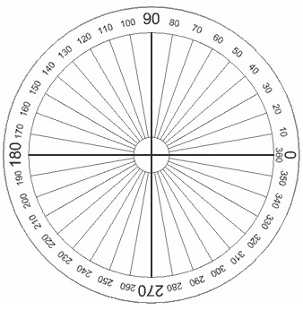{.imgcentre width=400px}

2. Dessiner des lignes
    1. Le "papier" est muni d'un repère, comme en mathématiques (en grisé sur la figure suivante) :
    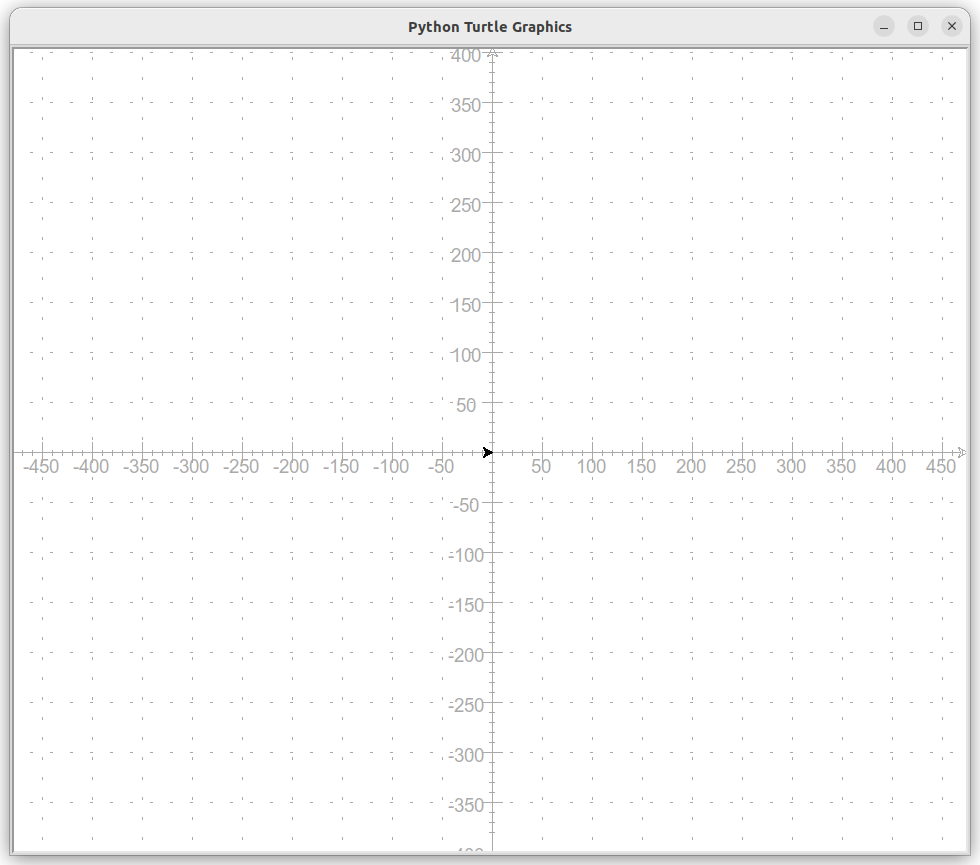{.imgcentre width=500px}
    Où se situe le crayon initialement ?
    2. Pour dessiner des lignes, on peut simplement déplacer le crayon avec `goto` en donnant les coordonnées du point d'arrivée. Par exemple pour tracer le segment indiqué par un :material-numeric-1-circle: sur la figure suivante on a utilisé l'instruction :
    ```python
    crayon.goto(200,200)
    ```
    {.imgcentre width=500px}
    Compléter le programme afin de tracer les deux autres segments.

        !!! retenir "A retenir !"
            Pour simplement **déplacer** le crayon sans tracer de traits, on utilise `penup` et pour reposer le crayon `pendown`
            par exemple, 
            ```python
            crayon.penup()
            crayon.goto(-100,100)
            crayon.pendown()
            ```
            déplace le crayon en `(-100,100)` sans tracer de trait.

    4. On peut aussi tracer un trait en faisant **avancer** le crayon d'un nombre de pixels. En effet le crayon est orienté dans une direction (le sens de la flèche) et pour le faire avancer on utilisera `forward` (`backward` permet de reculer). L'orientation de la tortue peut être fixée à une direction donnée grâce à `setheading` ou modifiée grâce à `left` (qui tourne de l'angle donné à gauche) ou `right` (qui tourne de l'angle donnée à droite).
    Par exemple pour tracer le segment indiqué par un :material-numeric-2-circle: sur la figure suivante, *après avoir positionnée la tortue en `(-100,100)`*, on a utilisé  :
    ```python
    crayon.setheading(90)
    crayon.forward(150)
    ```
    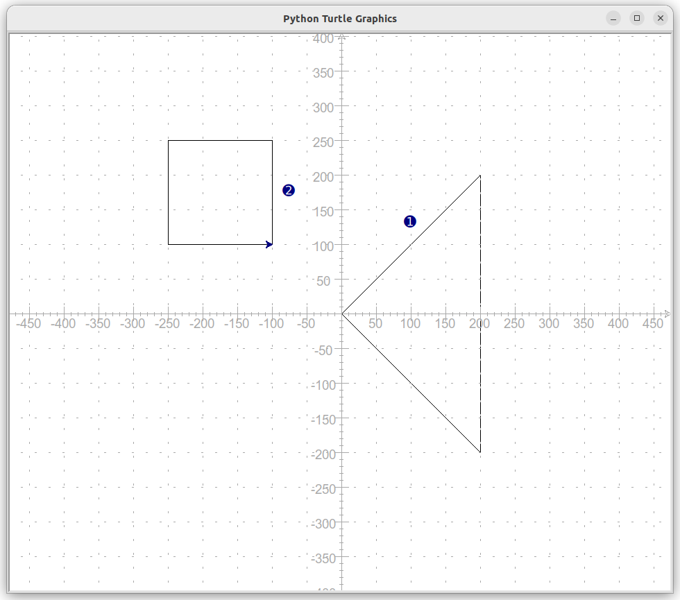{.imgcentre width=500px}
    Compléter le programme afin de tracer le carré.

3. Tracer des cercles

    1. Pour tracer un cercle, on utilise `circle` en indiquant son rayon, **attention** la tortue n'est **{{sc("pas")}}** le centre du cercle. Elle est un point du cercle, le centre se situant à gauche de l'orientation de la tortue comme indiqué sur le schéma suivant :
    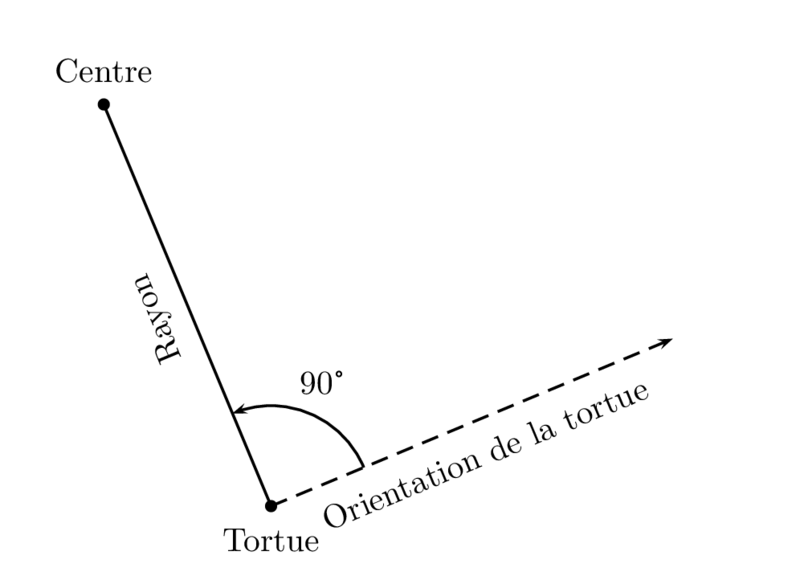{.imgcentre width=500px}
    Compléter la figure en traçant le cercle indiqué par un :material-numeric-3-circle: :
    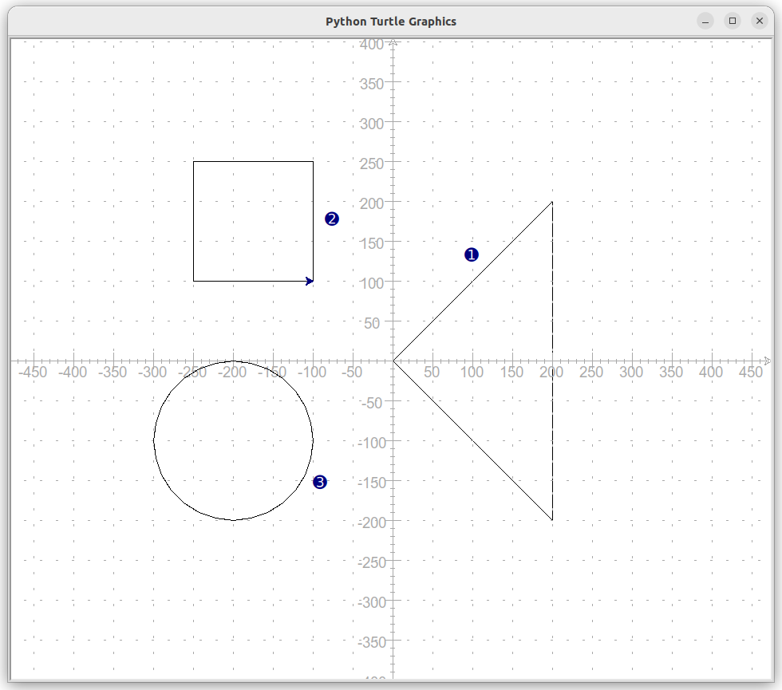{.imgcentre width=500px}

4. Modifier le crayon et le papier

    !!! retenir "A retenir"
        * On peut modifier l'épaisseur du trait grâce à `pensize`
        * On peut modifier la couleur du trait grâce à `pencolor`
        * On peut modifier la couleur du fond grâce à `bgcolor`
        * Pour remplir une surface, on commence sa construction avec `begin_fill` et on la termine avec `begin_fill`
        * On peut modifier la couleur de remplissage grâce à `fillcolor`
        Les couleurs sont données sous la forme `(r,g,b)`, en hexadécimal comme en html (par exemple `#12A5F2`) ou encore avec un nom en anglais (`black`, `red`, `blue`, `brown`, ...)

    Réaliser le dessin ci-dessous :
    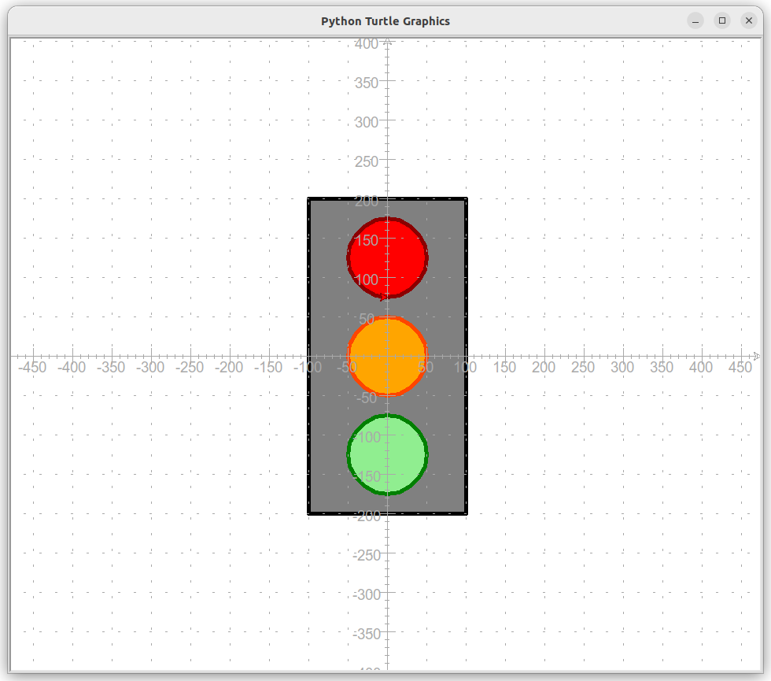{.imgcentre width=500px}

    !!! aide
        * Le crayon a une épaisseur de 5
        * Les couleurs utilisées sont `black` et `grey` (pour le rectangle) puis `green`,`orangered`,`darkred`,`lightgreen`,`orange` et `red` pour les cercles
    
{{ titre_activite("Premières fonctions",["python"]) }}

On souhaite dessiner un "bonhomme bâton" tel que celui représenté ci-dessous :
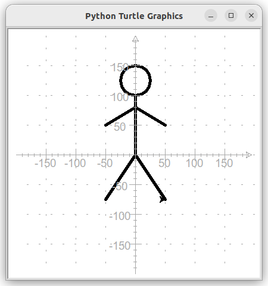{.imgcentre width=500px}
La couleur du crayon est `black`, son épaisseur 5.

1. Ecrire un programme Python permettant de dessiner la tête
2. Tracer la ligne représentant le corps
3. Tracer chacun des deux bras
4. Remarquons ques les instructions permettant de tracer les "bâtons" du bonhomme sont très similaires. En effet :
    * on relève le crayon avec `penup`
    * on se positionne sur une extrémité de la ligne avec `goto`
    * on abaisse le crayon avec `pendown`
    * on se déplace jusqu'à l'autre extrémité avec un nouveau `goto`
    L'idée est donc de définir un **bloc réutilisable** avec ces quatre instructions afin de tracer chacune des lignes en précisant leurs extrémités. 
    Ces blocs d'instructions sont ce qu'on appelle des **fonctions**, ils commencent par `def`. Les instructions contenues dans les fonctions peuvent dépendre de certaines valeurs. Dans notre cas, ces paramètres seront :
        * les coordonnées `x1` et `y1` de l'une des extrémités de la ligne
        * les coordonnées `x2` et `y2` de l'autre extrémité.

    Ajouter les instructions suivantes à votre programme :
    ```python
    def ligne(x1,y1,x2,y2):
        crayon.penup()
        crayon.goto(x1,y1)
        crayon.pendown()
        crayon.goto(x2,y2)
    ```
    On dispose maintenant d'une fonction permettant de tracer n'importe quelle ligne en donnant ses extrémités.
    Utiliser cette fonction pour tracer les jambes et terminer le bonhomme.


5. Ecrire une fonction `carre` permettant de tracer un carré en donnant les coordonnées de sont coin inférieur gauche et la longueur de son côté. 

    !!! aide
        Cette fonction accepte donc trois paramètres, qu'on pourra nommer `x`, `y` (les coordonnées du coin inférieur gauche) et `c` la longueur du côté.


6. Utiliser la fonction `carre` afin de tracer la figure suivante :
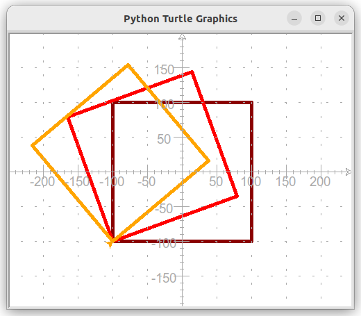{.imgcentre width=500px}
On précise que :
    * les côtés des carrés sont 200, 190 et 180 
    * les couleurs des carrés sont "darkred", "red" et "orange"
    * les inclinaisons par rapport à l'horizontale sont 0, 10 et 20 


{{ titre_activite("Boucles",["python"]) }}

On souhaite dessiner avec  Turtle, la frise suivante d'inspiration grecque :  
{.imgcentre width=400px}
Le motif répété dans cette frise a été isolé en rouge ci-dessous :  
{.imgcentre width=400px}

1. Ecrire une fonction python `motif` qui ne prend pas d'argument et trace ce motif à partir de la position courante de la tortue. On utilisera un crayon de taille 15 et les dimensions du motif sont indiqués sur la figure ci-dessous :
{.imgcentre width=500px}
2. En plaçant correctement la tortue au début et en effectuant plusieurs appels à la fonction `motif`, dessiner la frise (pour tracer les deux lignes qui entourent la frise, on pourra utiliser la fonction `ligne` déjà vue ci-dessus)
3. Pour répondre à la question précédente, vous avez du taper :
```python
motif()
motif()
motif()
motif()
```
De façon répéter le dessin du motif, une boucle `for` en python permet **notamment** de répéter un certain nombre de fois un bloc d'instructions. Par exemple, pour répéter 5 fois le motif on écrit :
```python
for i in range(5):
    motif()
```
On dit que `i` est l'**indice** de boucle, c'est une variable qui prendra successivement les valeurs 0,1,2,3 et 4 à chaque passage dans la boucle.  
Utiliser une boucle pour dessiner la frise.

4. On souhaite maintenant qu'un motif sur deux soit d'une couleur différente, comme ci-dessous :
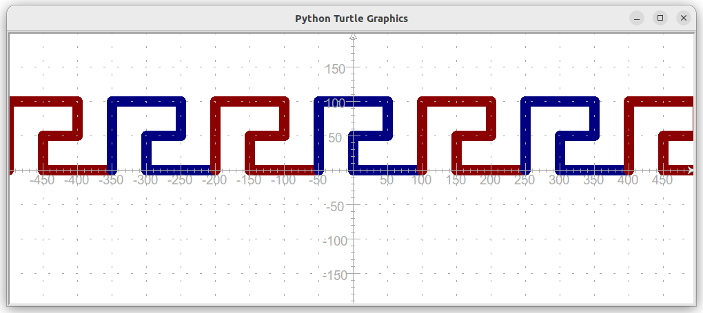{.imgcentre width=600px}
On utilise ici une **instruction conditionnelle** qui va changer la couleur du crayon suivant que l'indice de boucle soit pair ou impair :
```python
if i%2 == 0:
        crayon.color("darkred")
else:
    crayon.color("navy")
```

    1. Rappeler le rôle de l'opération `%`
    2. Intégrer ce bloc d'instructions à la boucle `for` et tracer la frise colorée.

{{ titre_activite("Plus loin avec les boucles",["python"]) }}
On souhaite dessiner la grille suivante à l'aide du module `turtle` de Python : 
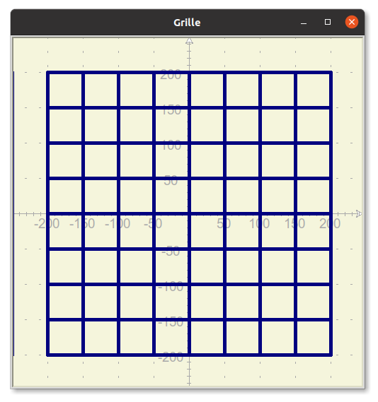{: .imgcentre}
On dispose déjà d'un début de programme qui définit les propriétés du papier et du crayon ainsi que  la fonction `ligne` permettant de tracer une ligne en donnant les deux extrémités (voir activités précédentes) :
```python
import turtle

# Création du "papier" et du "crayon"
crayon = turtle.Turtle()
papier = turtle.Screen()
# Taille, dimension et couleur pour le papier et le crayon
papier.bgcolor("beige")
papier.setup(width=500,height=500)
crayon.color("navy")
crayon.pensize(5)

def ligne(x1,y1,x2,y2):
    crayon.penup()
    crayon.goto(x1,y1)
    crayon.pendown()
    crayon.goto(x2,y2)
```

1. Écrire les instructions permettant de tracer les lignes horizontales.
2. Une (bien) meilleure solution
    1. Vérifier que les instructions suivantes permettent de tracer les lignes verticales :
    ```python
    for abscisse in range(-200,250,50):
        ligne(abscisse,-200,abscisse,200)
    ```
    2. Quelles sont les valeurs prises successives prises par la variable `abscisse` dans le programme précédant ?
    3. Rappeler le rôle des paramètres de `range`
3. Tracer les lignes horizontales en utilisant une boucle `for`


## Cours

{{ aff_cours(num) }}


## QCM

{{qcm_chapitre(num)}}

## Exercices

{{ exo("Quelques dessins avec turtle",[],0) }}
Ecrire un programme Python permettant de dessiner les figures suivante :
!!! Aide
    On donne le squelette de programme suivant qui servira de point de départ :
    ```python3
        import turtle
        papier = turtle.Screen()
        crayon = turtle.Turtle()
        crayon.pensize(5)
        crayon.color("navy")
    ```

1. La lettre H <br>
{: .imgcentre}

2. Une croix centrée sur l'origine <br>

    !!! Attention
        * La longueur totale d'une branche de couleur est de 200 pixels
        * Les couleurs des branches sont *navy* et *darkred*
        * La branche de couleur *navy* fait un angle de 45° avec l'horizontale
    {: .imgcentre}

3. Des cercles <br>
{: .imgcentre}

{{ exo("Utilisation d'une fonction",[])}}

!!! Rappel
    On donne ci-dessous le code de la fonction `ligne(x1,y1,x2,y2)` vue dans l'activité 2, elle permet de tracer la ligne joignant les points d'extrémités `(x1,y1)` et `(x2,y2)`
    ```python3
        def ligne(x1,y1,x2,y2):
            crayon.penup()
            crayon.goto(x1,y1)
            crayon.pendown()
            crayon.goto(x2,y2)
    ```

1. En utilisant la fonction `ligne`, construire la grille de morpion suivante :
{: .imgcentre}
2. Dessiner de nouveau la [lettre H de l'exercice 1](#exercice-1-quelques-dessins-avec-turtle) en vous aidant de cette fonction. 
3. Comparer les deux programmes (avec et sans fonction), qu'en pensez-vous ?

{{ exo("Ecrire une fonction",[])}}

Le but de l'exercice est de pouvoir dessiner une croix dans l'une quelconque des cases de la grille de morpion de l'exercice précédent. Comme par exemple dans la case supérieure droite tel qu'illustré ci-dessous.
{: .imgcentre}
Les croix ont toujours la même couleur (*green*) et la même taille (des branches de longueur 40 pixels), seule la position de leur centre varie. On décide donc, d'écrire une fonction `croix(x,y)` qui trace la croix à partir du point de coordonnées `(x,y)`

1. Recopier et compléter l'écriture de la fonction croix (pour l'instant seule la branche supérieure droite est tracée):
```python3
    def croix(x,y):
        crayon.penup()
        crayon.goto(x,y)
        crayon.pendown()
        crayon.setheading(45)
        crayon.forward(40)
        ...
```
2. Utilisation de la fonction
    1. Quel appel à la fonction `croix` permet de tracer la croix se situant dans la case supérieure droite ?
    2. Quel sera le résultat de l'instruction `croix(-100,0)` ?

{{ exo("Une fonction cercle",[])}}

1. En vous inspirant de l'exercice 3, écrire une fonction `cercle(x,y)` qui permet de tracer un cercle de rayon 35 et de couleur *darkred* dans l'une quelconque des cases de la grille de morpion. Comme par exemple ci-dessous dans la case inférieure droite.
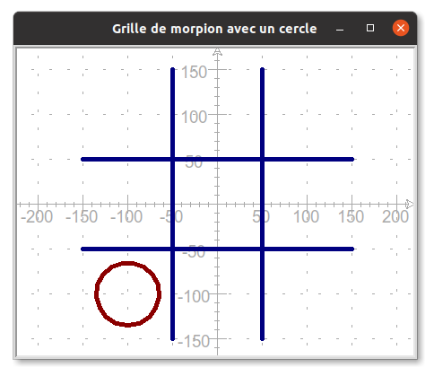{: .imgcentre}
2. Reproduire la grille de morpion suivante en utilisant les fonctions `croix` et `cercle` :
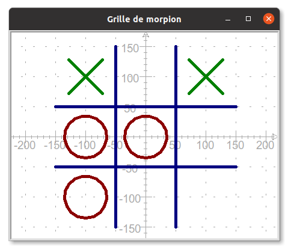{: .imgcentre}


{{ exo("Quelques figures avec `turtle`",[]) }}
Construire les figures suivantes (le repère est là pour vous aider et ne doit pas être reproduit):

1. L'escalier
{: .imgcentre width=500px}
2. Cercles concentriques (les couleurs alternent entre `blue` et `lightblue`, le crayon a une épaisseur de 10, les cercles ont pour rayon 10,20,30, ...)
{: .imgcentre width=500px}
3. Hachures
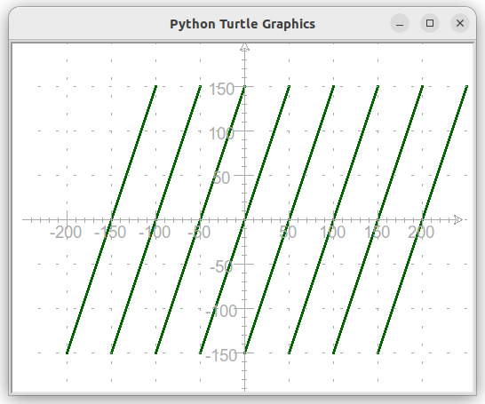{.imgcentre width=500px}


{{ exo("Lignes",[],0)}}

1. En utilisant une boucle `for` contenant une instruction conditionnelle, écrire un programme Python permettant de tracer la figure suivante :
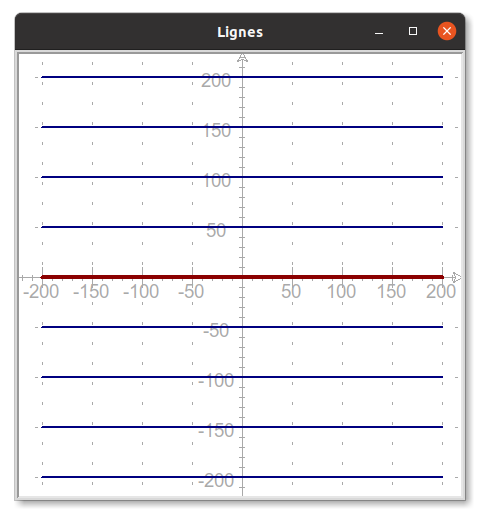{: .imgcentre}
La ligne centrale est tracé avec un crayon d'épaisseur 4 et en couleur *darkred*, toutes les autres lignes sont d'épaisseur 2 et en couleur *navy*.

2. Modifier l'instruction conditionnelle contenue dans le boucle `for` de façon à ce que les lignes au dessus de la ligne centrale soient tracées en couleur *green*.

{{ exo("Suite de carrés",[])}}

Ecrire un programme python permettant de dessiner la figure ci-dessous :
{: .imgcentre}
Votre programme devra contenir :

* la définition d'une fonction `carre` et des appels à cette fonction,
* une boucle,
* une instruction conditionnelle.


{{ exo("Polygone régulier",["maths"]) }}

1. Ecrire une fonction `triangle_equilateral(c)` qui trace un triangle équilatéral de côte `c` à partir de la position courante de la tortue.

    !!! Aide
        * On rappelle que tous les angles d'un triangle équilatéral sont égaux et valent 60°.
        * Les deux premières étapes de la construction sont illustrées ci-dessous.
        {: .imgcentre}
        * Comme un angle plat mesure 180°, on a tourné de 120° de façon à former un angle intérieur de 180°-160° = 60°

2. Ecrire une fonction `carre(c)` qui trace un carré de côte `c` à partir de la position courante de la tortue.
3. Ecrire une fonction `polygone_regulier(n,c)` qui trace un polygone régulier de côte `c` à partir de la position courante de la tortue.
    
    !!! Rappel
 
        * Un polygone régulier est un polygone dont tous les côtés sont de la même longueur et tous les angles sont égaux.
        * Les angles d'un polygone régulier à $n$ côtés mesurent $\dfrac{360}{n}$

{{ exo("Drapeau",[]) }}

Le module `turtle` permet aussi de colorier des surfaces, pour cela: <br>
:octicons-triangle-right-16: on fixe la couleur de remplissage avec  `crayon.fillcolor()` <br>
:octicons-triangle-right-16: avant de commencer le dessin de la surface, on écrit `crayon.begin_fill()`<br>
:octicons-triangle-right-16: à la fin de la construction de la surface, on écrit  `crayon.end_fill()`<br>
Par exemple, pour dessiner un  cercle rempli en rouge :
```python
crayon.fillcolor("red")
crayon.begin_fill()
crayon.circle(50)
crayon.end_fill()
```

1. Ecrire et tester une fonction `rectangle_rempli(x,y,largeur,longueur,couleur)` qui trace un rectangle rempli avec la couleur `couleur`, de dimensions `largeur x longueur` et dont le coin inférieur gauche est situé au point de coordonnées `(x,y)`
2. En utilisant la fonction ci-dessus, écrire un programme Python permettant de dessiner un drapeau français de dimension `300` sur `200` (chacun des trois rectangles formant le drapeau est de dimensions `100x200`)
3. Même question avec le [drapeau de la Suède](https://en.wikipedia.org/wiki/Flag_of_Sweden){target=_blank}. 


{{ exo("Panneau de signalisation",[]) }}
Ecrire un programme Python permettant de dessiner le panneau de signalisation de votre choix. Quelques exemples sont proposés ci-dessous.<br>
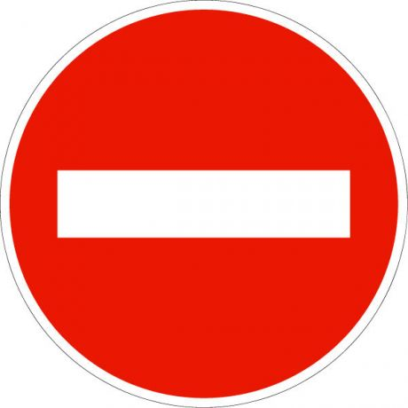{width=150px} &nbsp;
{width=150px}  &nbsp;
{width=150px}  &nbsp;
{width=150px} 

!!! Aide
    Consulter la [page de documentation](https://docs.python.org/fr/3/library/turtle.html){target=_blank} du module `turtle` et plus particulièrement celle concernant la fonction `write` qui permet d'écrire à l'écran

## Humour d'informaticien

{: .imgcentre width=500px}