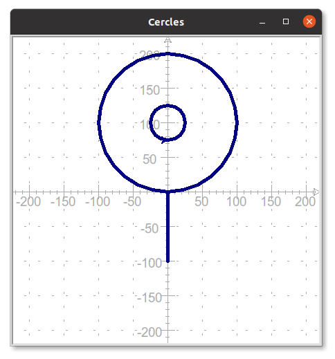
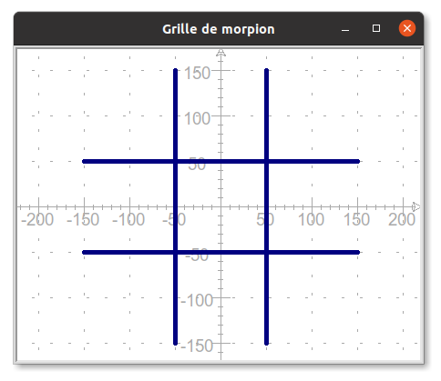
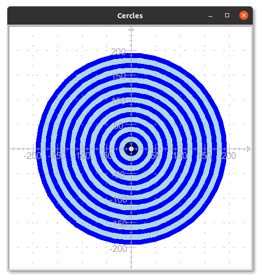
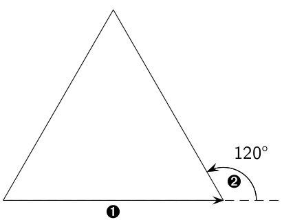




 


{{ titre_chapitre(num,titre,theme,niveau)}}
## Remarque

Cette initiation à Python utilise le module `turtle` avec le projet de la réalisation du jeu du pendu.
Une autre découverte de Python plus "classique" est disponible sous forme de notebooks et pourra être utilisée pour compléter l'approche avec `turtle` et le jeu du pendu.

??? note "Notebooks"
    * **Notebook 1** : `print` pour afficher dans le terminale, notion de variable.
    {{ telecharger("Jupyter Notebook","./notebook/1.Print-Variables.ipynb") }}
    * **Notebook 2** : `input` pour demander une valeur, type des variables.
    {{ telecharger("Jupyter Notebook","./notebook/2.Input-Types.ipynb") }}
    * **Notebook 3** : A la découverte des instructions conditionnelles.
    {{ telecharger("Jupyter Notebook","./notebook/3.InstructionsConditionnelles.ipynb") }}
    * **Notebook 4** : Les boucles `for` et `while`.
    {{ telecharger("Jupyter Notebook","./notebook/4.Boucles.ipynb") }}
    * **Notebook 5** : Les fonctions et l'instruction `return`.
    {{ telecharger("Jupyter Notebook","./notebook/5.Fonctions.ipynb") }}
    * **Notebook 6** : A la découverte des listes (partie 1)
    {{ telecharger("Jupyter Notebook","./notebook/6.Liste-1.ipynb") }}
    * **Notebook 7** : A la découverte des listes (partie 2)
    {{ telecharger("Jupyter Notebook","./notebook/6.Liste-2.ipynb") }}

## Activités 

{{ titre_activite("Desssiner avec le module turtle",["notebook"],0) }}


{{ telecharger("Jupyter Notebook","./notebook/pendu1.ipynb")}}


{{ titre_activite("Premières fonctions",["notebook"]) }}


{{ telecharger("Jupyter Notebook","./notebook/pendu2.ipynb")}}

{{ titre_activite("Boucles",["notebook"]) }}


{{ telecharger("Jupyter Notebook","./notebook/pendu3.ipynb")}}


## Cours

{{ aff_cours(num) }}


## QCM

{{qcm_chapitre(num)}}

## Exercices

{{ exo("Quelques dessins avec turtle",[],0) }}
Ecrire un programme Python permettant de dessiner les figures suivante :
!!! Aide
    On donne le squelette de programme suivant qui servira de point de départ :
    ```python3
        import turtle
        papier = turtle.Screen()
        crayon = turtle.Turtle()
        crayon.pensize(5)
        crayon.color("navy")
    ```

1. La lettre H <br>
{: .imgcentre}

2. Une croix centrée sur l'origine <br>

    !!! Attention
        * La longueur totale d'une branche de couleur est de 200 pixels
        * Les couleurs des branches sont *navy* et *darkred*
        * La branche de couleur *navy* fait un angle de 45° avec l'horizontale
    {: .imgcentre}

3. Des cercles <br>
{: .imgcentre}

{{ exo("Utilisation d'une fonction",[])}}

!!! Rappel
    On donne ci-dessous le code de la fonction `ligne(x1,y1,x2,y2)` vue dans l'activité 2, elle permet de tracer la ligne joignant les points d'extrémités `(x1,y1)` et `(x2,y2)`
    ```python3
        def ligne(x1,y1,x2,y2):
            crayon.penup()
            crayon.goto(x1,y1)
            crayon.pendown()
            crayon.goto(x2,y2)
    ```

1. En utilisant la fonction `ligne`, construire la grille de morpion suivante :
{: .imgcentre}
2. Dessiner de nouveau la [lettre H de l'exercice 1](#exercice-1-quelques-dessins-avec-turtle) en vous aidant de cette fonction. 
3. Comparer les deux programmes (avec et sans fonction), qu'en pensez-vous ?

{{ exo("Ecrire une fonction",[])}}

Le but de l'exercice est de pouvoir dessiner une croix dans l'une quelconque des cases de la grille de morpion de l'exercice précédent. Comme par exemple dans la case supérieure droite tel qu'illustré ci-dessous.
{: .imgcentre}
Les croix ont toujours la même couleur (*green*) et la même taille (des branches de longueur 40 pixels), seule la position de leur centre varie. On décide donc, d'écrire une fonction `croix(x,y)` qui trace la croix à partir du point de coordonnées `(x,y)`

1. Recopier et compléter l'écriture de la fonction croix (pour l'instant seule la branche supérieure droite est tracée):
```python3
    def croix(x,y):
        crayon.penup()
        crayon.goto(x,y)
        crayon.pendown()
        crayon.setheading(45)
        crayon.forward(40)
        ...
```
2. Utilisation de la fonction
    1. Quel appel à la fonction `croix` permet de tracer la croix se situant dans la case supérieure droite ?
    2. Quel sera le résultat de l'instruction `croix(-100,0)` ?

{{ exo("Une fonction cercle",[])}}

1. En vous inspirant de l'exercice 3, écrire une fonction `cercle(x,y)` qui permet de tracer un cercle de rayon 35 et de couleur *darkred* dans l'une quelconque des cases de la grille de morpion. Comme par exemple ci-dessous dans la case inférieure droite.
{: .imgcentre}
2. Reproduire la grille de morpion suivante en utilisant les fonctions `croix` et `cercle` :
{: .imgcentre}

{{ exo("Grille",[]) }}

Le but de l'exercice est d'utiliser les boucles pour tracer la grille suivante :
{: .imgcentre}

On donne le squelette de programme suivante qui fixe les paramètres du dessin et contient la fonction `ligne(x1,y1,x2,y2)` vue dans les notebooks d'activité permettant de tracer une ligne allant du point de coordonnées `(x1,y1)` au point de coordonnées `(x2,y2)`.

```python
    import turtle

    # Création du "papier" et du "crayon"
    crayon = turtle.Turtle()
    papier = turtle.Screen()
    # Taille, dimension et couleur pour le papier et le crayon
    papier.bgcolor("beige")
    papier.setup(width=500,height=500)
    crayon.color("navy")
    crayon.pensize(5)

    def ligne(x1,y1,x2,y2):
        crayon.penup()
        crayon.goto(x1,y1)
        crayon.pendown()
        crayon.goto(x2,y2)
```

1. Ecrire une boucle `for` permettant de tracer les lignes horizontales.

    !!! Aide
        En cas de difficultés, écrire le tracé normal des lignes (sans boucle). Observer vos instructions de façon à repérer les variables qui doivent être modifiées et celles qui restent fixes.

2. Ecrire une boucle `for` permettant de tracer les lignes verticales.

{{ exo("Quelques figures avec `turtle`",[]) }}
Construire les figures suivantes (le repère est là pour vous aider et ne doit pas être reproduit):

1. L'escalier
{: .imgcentre}
2. Cercles concentriques (les couleurs alternent entre `blue` et `lightblue`, le crayon a une épaisseur de 10, les cercles ont pour rayon 10,20,30, ...)
{: .imgcentre}

{{ exo("Polygone régulier",["maths"]) }}

1. Ecrire une fonction `triangle_equilateral(c)` qui trace un triangle équilatéral de côte `c` à partir de la position courante de la tortue.

    !!! Aide
        * On rappelle que tous les angles d'un triangle équilatéral sont égaux et valent 60°.
        * Les deux premières étapes de la construction sont illustrées ci-dessous.
        {: .imgcentre}
        * Comme un angle plat mesure 180°, on a tourné de 120° de façon à former un angle intérieur de 180°-160° = 60°

2. Ecrire une fonction `carre(c)` qui trace un carré de côte `c` à partir de la position courante de la tortue.
3. Ecrire une fonction `polygone_regulier(n,c)` qui trace un polygone régulier de côte `c` à partir de la position courante de la tortue.
    
    !!! Rappel
 
        * Un polygone régulier est un polygone dont tous les côtés sont de la même longueur et tous les angles sont égaux.
        * Les angles d'un polygone régulier à $n$ côtés mesurent $\dfrac{360}{n}$

{{ exo("Drapeau",[]) }}

Le module `turtle` permet aussi de colorier des surfaces, pour cela: <br>
:octicons-triangle-right-16: on fixe la couleur de remplissage avec  `crayon.fillcolor()` <br>
:octicons-triangle-right-16: avant de commencer le dessin de la surface, on écrit `crayon.begin_fill()`<br>
:octicons-triangle-right-16: à la fin de la construction de la surface, on écrit  `crayon.end_fill()`<br>
Par exemple, pour dessiner un  cercle rempli en rouge :
```python
crayon.fillcolor("red")
crayon.begin_fill()
crayon.circle(50)
crayon.end_fill()
```

1. Ecrire et tester une fonction `rectangle_rempli(x,y,largeur,longueur,couleur)` qui trace un rectangle rempli avec la couleur `couleur`, de dimensions `largeur x longueur` et dont le coin inférieur gauche est situé au point de coordonnées `(x,y)`
2. En utilisant la fonction ci-dessus, écrire un programme Python permettant de dessiner un drapeau français de dimension `300` sur `200` (chacun des trois rectangles formant le drapeau est de dimensions `100x200`)
3. Même question avec le [drapeau de la Suède](https://en.wikipedia.org/wiki/Flag_of_Sweden){target=_blank}. 


{{ exo("Panneau de signalisation",[]) }}
Ecrire un programme Python permettant de dessiner le panneau de signalisation de votre choix. Quelques exemples sont proposés ci-dessous.<br>
{width=150px} &nbsp;
{width=150px}  &nbsp;
{width=150px}  &nbsp;
{width=150px} 

!!! Aide
    Consulter la [page de documentation](https://docs.python.org/fr/3/library/turtle.html){target=_blank} du module `turtle` et plus particulièrement celle concernant la fonction `write` qui permet d'écrire à l'écran