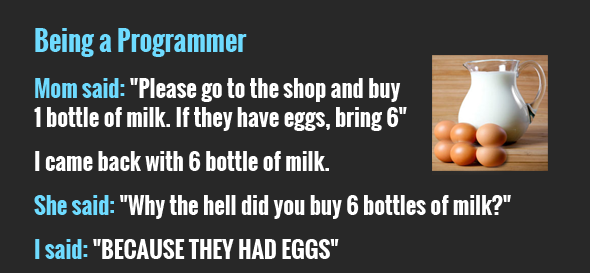




 

{{ titre_chapitre(num,titre,theme,niveau)}}
 
## Activités 

{{ titre_activite("Marche aléatoire",[],0) }}

Le but de l'activité est d'utiliser Python (et son module turtle) pour simuler une [marche aléatoire](https://fr.wikipedia.org/wiki/Marche_al%C3%A9atoire){target=_blank}. C'est à dire qu'on simule le déplacement d'une tortue initialement situé en `(0,0)` et qui se déplace aléatoirement de 10 pixels dans l'une des quatre directions avec la même probabilité de $\dfrac{1}{4}$ pour chaque direction. On donne le début de code suivant :
```python
import turtle
# randint(a,b) permet de tirer un nombre au sort entre a et b
from random import randint
tortue = turtle.Turtle()
papier = turtle.Screen()

# On fixe les dimensions de la feuille de papier
papier.setup(height=450,width=450)
# vitesse et forme de la souris
tortue.speed(0)
tortue.shape("turtle")
```

1. La fonction `randint`
    1. Ce programme importe la fonction `randint`, dans Python en mode console, rechercher l'aide sur cette fonction après l'avoir importée
    2. Utiliser cette fonction pour générer un entier au hasard entre 1 et 6

2. Recopier ce programme, le compléter en écrivant une fonction `pas` qui ne prend pas d'argument, et fait avancer la tortue dans l'une des quatre directions cardinales au hasard.

3. Ecrire une boucle `for` permettant de simuler une promenade aléatoire de 100 pas (voir ci-dessous pour un exemple de résultat obtenu)
{.imgcentre width=400px}

4.  Boucle non bornée

    1. Tracer en rouge le cercle de centre $(0,0)$ et de rayon $200$.
    2. On veut déplacer la tortue jusqu'à ce qu'elle franchisse le cercle, peut-on utiliser une boucle `for` ?
    3. A quelle condition, portant sur ses coordonnées $(x,y)$, la tortue est-elle en dehors du cercle ?
    4. Ecrire une fonction `dans_cercle` qui renvoie `True` ou  `False` suivant que la tortue se trouve ou non dans le cercle. On pourra utiliser `tortue.xcor()` et `tortue.ycor()` qui renvoie respectivement l'abscisse et l'ordonnée de la tortue.

        !!! retenir "A retenir"
            L'instruction `return` permet à une fonction de renvoyer un résultat.
    
    5. Ecrire une boucle `while` de façon à ce que la tortue se promène jusqu'à sortir du cercle de centre $(0,0)$ et de rayon $200$ (voir ci-dessous pour un exemple de résultat) :
    {.imgcentre width=400px}


{{ titre_activite("Les listes de Python",["notebook"]) }}

{{ telecharger("Jupyter Notebook","./notebook/6.Liste-1.ipynb") }}

{{ titre_activite("Parcours d'une liste",["notebook"]) }}

{{ telecharger("Jupyter Notebook","./notebook/6.Liste-2.ipynb") }}

## Cours

{{ aff_cours(num) }}


## QCM

{{qcm_chapitre(num)}} 

## Exercices


{{ exo("Génération de listes en Python",[])}}

1. On considère le programme suivant :
```python
liste1 = [0]*100
liste2 = [0 for k in range(100)]
liste3 = []
for k in range(100):
    liste3.append(0)
```

    1. Quel est le contenu de chacune des listes ?
    2. Indiquer par quel procédé chacune de ces listes a été crée.

2. Ecrire un programme python permettant de créer les listes suivantes :
    1. Une liste contenant 12 fois le chiffre 7.
    2. La liste des nombres entiers de 1 à 100.
    3. Une liste contenant 1000 nombres tirés au sort entre 1 et 6.

        !!! Aide 
            On rappelle que la fonction `randint` peut être importer depuis le module `random`, elle permet de tirer un nombre en deux valeurs `a` et `b` données en paramètres.

    4. La liste des cubes des entiers de 1 à 10.


{{ exo("Parcours de listes en Python",[])}}

On suppose qu'on dispose d'une liste de notes, on veut écrire une fonction qui renvoie le nombres de notes qui sont en dessous de la moyenne. 

1. On considère une première version de cette fonction :
```python
def inferieur_moyenne(liste_notes):
	nb = 0
	for note in liste_notes:
	    if .....:
	    	nb = .......
	return ...
```
    1. Recopier et compléter cette fonction
    2. Tester cette fonction 

2. Voici une deuxième version de cette fonction :
```python
def inferieur_moyenne(liste_notes):
	nb = 0
	for indice in ........:
	    if ........... : 
	    	nb = .......
	return ...
```
    1. Recopier et compléter cette fonction
    2. Tester cette fonction

3. Quelle est la différence principale entre ces deux versions de la même fonction ?
4. Ecrire les fonctions suivantes :
    
    1. `max_liste` qui prend comme argument une liste non vide de nombres et renvoie le plus grand de ces nombres.
    2. `somme_liste` qui prend comme argument une liste non vide de nombres et renvoie la somme de ces nombres.
    3. `moyenne_liste` qui prend comme argument une liste non vide de nombres et renvoie la moyenne de ces nombres.


{{ exo("Recherche d'occurences",[])}}

1. Ecrire une fonction `present(elt,liste)` qui renvoie `True` si `elt` se trouve dans la liste `liste` et `False` sinon. Par exemple `present(3,[1,4,5]` renvoie `False`, par contre `present(4,[1,4,5]` renvoie `True`.
2. Tester cette fonction
3.  Ecrire une fonction `occurence(elt,liste)` qui renvoie le nombre de fois où `elt` apparaît dans `liste`.


{{ exo("Chaines de caractères",[]) }}

1. Ecrire une fonction `compte_caractere(s,c)` qui prendre en argument une chaîne de caractère `s` et un caractère `c` et retourne le nombre de fois où `c` apparait dans `s`. Par exemple `compte_caractere("informatique","i"")` renvoie 2 puisqu'il y a deux `i` dans le mot `informatique`
2. Ecrire une fonction `inverse` qui prend en argument une chaîne de caractère et retourne cette chaîne écrite à l'envers. Par exemple, `inverse("Python")` donnera `"nohtyP"`.
3. Ecrire une fonction `compare` qui prend en argument deux chaînes de caractères et renvoie le nombre de fois où ces deux chaines on la même lettre au même emplacement. Par exemple, `compare("Python","Poterie")` retourne 2 car le "P" et le "t" sont situés aux mêmes emplacements dans les deux mots.

## Humour d'informaticien

{: .imgcentre width=500px}