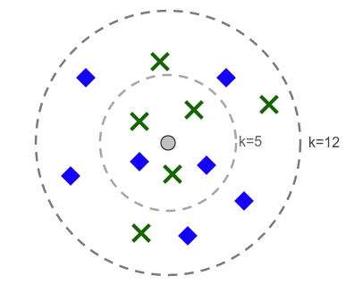




 


{{ titre_chapitre(num,titre,theme,niveau)}}
 
## Activités 
 
{{ titre_activite("Classification",[],0)}}


1. Dans un champ, à l'état sauvage deux types de fleurs ont poussés : des coquelicots et des violettes. On a représenté ci-dessous par un schéma la position de ces fleurs dans le champ.

    * les points rouges représentent des coquelicots
    * les points bleus représentent des violettes 

    {: .imgcentre}
    Comme vous pouvez le constater, en dépit de certaines variations, les violettes semblent plus pousser dans la partie inférieure gauche du champ tandis que les coquelicots poussent plutôt vers la partie centrale du champ. 

    Trois nouvelles pousses apparaissent dans ce champ, on les a représenté par des points de couleurs grises et on les identifie avec les noms `P1, P2` et `P3` comme représenté ci-dessous :
    {: .imgcentre}
    On cherche à prédire si ces pousses sont des coquelicots ou des violettes.

    1. Que peut-on dire pour la pousse `P1` ?
    2. Même question pour la pousse `P2`.
    3. Que dire du cas de `P3` ? Peut-on répondre avec le même niveau de confiance que pour `P1` et `P2` ?
    4. Ci-dessous on a tracé un cercle de façon à faire apparaître les 5 voisins les plus proches de la pousse P3. Prédire le cas de `P3` en choisissant l'espèce majoritaire de ce cercle.
    {: .imgcentre}
    5. A la question précédente, on a prédit le cas de `P3` avec l'**algorithme des k plus proches voisins**. Quel est le principe de cet algorithme ? Avec quelle valeur de **k** a-t-il été utilisé ?

2. On considère le nouvel exemple suivant dans lequel la donnée à classer est représentée par le point gris central:


    1. Quel est le résultat de l'algorithme des k plus proches voisins lorsque k=3 ?
    2. Même question lorsque k=6.
    3. Même question lorsque k=7.
    4. Que peut-on dire pour le résultat prédit par l'algorithme suivant les valeurs de k ?
    5. Quelles valeurs de k permettent d'éviter les cas d'égalités ?

{{ titre_activite("Mise en oeuvre en Python",["notebook"]) }}
{{ telecharger("Jupyter Notebook","notebook/PlusProchesVoisins.ipynb")}}
Dans cette activité, vous aurez aussi besoin du jeu de données suivant :
{{ telecharger("Jeu de données","files/C17/iris.csv")}}


## Cours

{{ aff_cours(num) }}


## QCM

{{qcm_chapitre(num)}} 


## Exercices

{{ exo("Appliquer l'algorithme des k plus proches voisins",[],0) }}

{: .imgcentre}

Quel sera le résultat de l'algorithme des $k$ plus proches voisins pour classer le point gris central lorsque :

1. $k=5$ ?
2. $k=12$ ?

{{ exo("Un cas particulier",[]) }}

On considère un exemple élémentaire de l'algorithme des $k$ plus proche voisin. On prend $k=1$ et chaque classe ne contient qu'un seul et unique point :
```python
classe1 = [(2,4))]
classe2 = [(-2,-2)] 
```
On veut déterminer la classe d'un nouveau point.

1. Expliquer le fonctionnement de l'algorithme dans ce cas particulier.
2. Ecrire la fonction `distance(point1,point2)` qui prend comme argument deux tuples `point1=(x1,y1)` et `point2=(x2,y2)` et renvoie la distance euclidienne entre les points de coordonnées $(x1,y1)$ et $(x2,y2)$.
3. Donner le résultat de l'algorithme des $k$ plus proches voisins pour les points suivants :
    * $(-2;5)$
    * $(-2;-4)$
    * $(0;1)$
4. Tracer un repère orthonormé, placer les points $A=(2;4)$ et $B=(-2;-2)$. Déterminer et représenter la zone où se situent les points de la `classe1` et ceux de la `classe2`.

    !!! aide
        Penser à utiliser la médiatrice du segment $[AB]$ après avoir rappelé la propriété de cette droite. 

{{ exo("Distance de Hamming",[]) }}
On définit la **distance de Hamming** entre deux chaines de caractères de *même longueur* comme le nombre de fois où ces deux chaines ont un caractère différent au même endroit. A titre d'exemples :  
:octicons-triangle-right-16: "ramer" et "taper" ont une distance de 2 ( r$\neq$t et m$\neq$p),  
:octicons-triangle-right-16: "python" et "java" ne sont pas comparables car ils n'ont pas la même longueur,  
:octicons-triangle-right-16: "tri" et "rit" ont une distance de 3 (pour tous les emplacements, les caractères de chacune des deux chaines sont différents). 

1. Donner les distances de Hamming entre les chaines suivantes :
    * "orange" et "ananas"
    * "fable" et "table"
    * "Alan" et "Ada"
    * "facile" et "habile"

2. Ecrire une fonction Python `distance_hamming(chaine1,chaine2)` qui renvoie la distance de Hamming entre les deux chaines passées en paramètre. La fonction ne renvoie rien lorsque les deux chaines n'ont pas la même longueur.

    !!! aide
        On rappelle qu'on accède au ième caractère d'une chaine `chaine` à l'aide de la notation crochets : `chaine[i]`


{{ exo("Classification des couleurs",[]) }}
La perception des couleurs peut varier en fonction des individus, le but de l'exercice est de classer une couleur donnée au format (R,V,B) dans l'une des classes suivantes : rouge, vert, bleu, jaune, orange, rose, mauve, gris, blanc, noir et marron.

1. Créer le jeu de données d'après votre propre perception des couleurs. Vous pouvez créer une application javascript générant au hasard des couleurs puis les classer suivant votre perception ou utiliser une [application en ligne](https://htmlcolorcodes.com/){target=_blank}.
2. Ecrire une fonction python calculant la distance euclidienne entre deux couleurs au format (R,V,B)
3. Utiliser l'algorithme des k plus proches voisins afin de prédire le classement d'une nouvelle couleur et comparer avec votre propre classement.

!!! note
    Cet exercice s'inspire de cette [application web](https://rgb-color-classifier.herokuapp.com/){target=_blank}


{{ exo("Idées de mini-projets",[])}}

1. Utiliser un algorithme des k plus proches voisins pour prédire l'origine latine ou grecque d'un mot 

    !!! aide
        * commencer par constituer un jeu de données déjà classées (donc une liste de mots dont vous connaissez l'origine)
        * définir une distance entre deux données (on peut par exemple utiliser la distance de Hamming)
        * tester plusieurs valeurs possibles pour le paramètre $k$ 

2. Utiliser un algorithme des k plus proches voisins pour prédire la survie des passagers du titanic. Les données sont à récupérer sur [kaggle](https://www.kaggle.com/c/titanic/data).