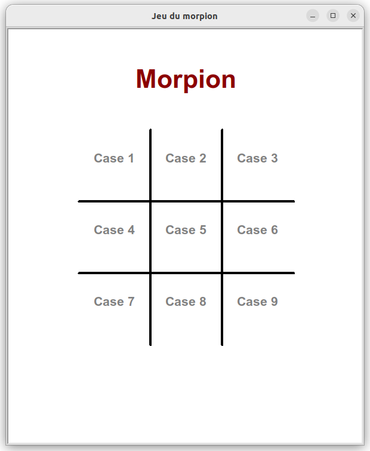
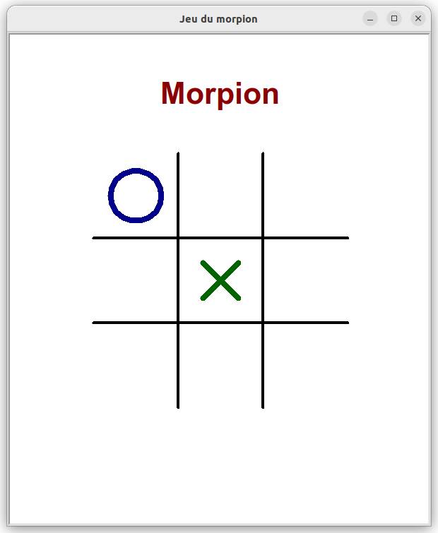

# Morpion


Dans le jeu du morpion (au tic-tac-toe)  deux joueurs s'affrontent dans le but d'aligner en premier  3 symboles sur une grille de 3x3 cases. 
On pourra consulter [la page wikipedia consacrée à ce jeu](https://fr.wikipedia.org/wiki/Tic-tac-toe){target=_blank} pour plus d'informations.

Le but du projet est de programmer ce jeu en python afin que deux joueurs humains puissent s'affronter dans une interface graphique réalisée avec le module `turtle`. 

## Etape 1 : réalisation du plateau de jeu
Dessiner la grille de jeu, prévoir un espace pour l'affichage de message pendant le jeu (coup invalide, victoire, match nul, ...).

!!! aide
    Pour faciliter le positionnement des différents éléments, on peut au préalable dessiner le repère de la tortue en version papier et y positionner les différents éléments afin d'avoir directement leurs coordonnées.

A la fin de cette étape on devrait donc disposer d'une fonction `dessine_jeu` qui dessine la grille et écrit le titre du jeu.

## Etape 2 : positionner un symbole dans la grille

On convient de numéroter les neuf cases de la grille de jeu de la façon suivante :
{.imgcentre width=600px}

Le but de cet étape est d'écrire :

* une fonction `dessine_croix` qui prend en paramètre le numéro de la case concernée et y dessine une croix. Par exemple `dessine_croix(5)` dessine une croix dans la case centrale.
* une fonction `dessine_rond` qui prend en paramètre le numéro de la case concernée et y dessine un rond. Par exemple, `dessine_rond(1)` dessine un rond dans la case située en haut et à gauche.

    
Dans l'illustration ci-dessous, on a testé nos fonctions en écrivant dans le programme principal :
```python
dessine_jeu()
dessine_croix(5)
dessine_rond(1)
```
{.imgcentre width=600px}


## Etape 3 : boucle principale du jeu et gestion des interactions avec les joueurs

Le but de cette étape est d'écrire la boucle principale du jeu ainsi qu'une fonction `demande_case` qui fait apparaître une fenêtre `textinput` du module turtle pour qu'un joueur y entre son coup sous la forme d'un numéro de case.
Un coup est valide lorsqu'il se situe sur la grille et que la case n'est pas *encore occupée*. On tiendra donc à jour des variables `case1`, `case2`, ..., `case9` qui représentent le contenu des cases. Par exemple, on pourra considérer que

* un 0 représente une case vide
* un 1 représente une croix
* un 2 représente un rond

Pour la boucle principale du jeu, puisque que le jeu s'arrête lorsqu'un joueur est victorieux ou qu'il n'y plus aucune case de libre, on peut  créer une variable booléenne `gagnant` initialisée à `False` ainsi qu'une variable `case_libre` initialisée à 9 et écrire une boucle `while not gagnant and case_libre>0`. Dans cette boucle, on fait appel aux fonctions écrites plus haut, pour jouer les coups successifs.

## Etape 4 : tester si trois symboles identiques sont alignés

Le but de cette étape est d'écrire une fonction `victoire` qui  renvoie `True` si trois symboles identiques sont alignés dans la grille. Cette fonction permettra de mettre à jour la variable `gagnant` après chaque coup joué.


A la fin de cette étape, on dispose donc d'un programme fonctionnel permettant à deux joueurs de s'affronter.
{.imgcentre width=600px}


## Etape 5 : aller plus loin

Cette étape consiste à améliorer le jeu plusieurs pistes sont proposées :

* pouvoir jouer à la souris (pour cela utiliser la fonction `onclick` du module turtle associé à `mainloop`)
* pouvoir revenir en arrière de un ou plusieurs coups dans la partie
* pouvoir choisir les couleurs, symboles, ...

