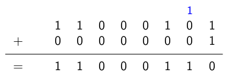

hide: - navigation  in docs.md



{{ corrige_sujetbac(repere_sujet) }}


{{ corrige_exobac(repere_sujet,1) }}

1. {.imgcentre width=600px}

2.  a. La variable `temp` contient le sommet de la pile `p1` c'est à dire `25`

    b. Le sommet a été dépilé puis empilé la pile n'a donc pas changé, `p1` contient les mêmes trois éléments :
    {{ pile([7,3,25])}}

3. 
```python
def addition(p):
    a = depiler(p)
    b = depiler(b)
    empiler(p,a+b)
```

    !!! warning "Attention"
        On a supposé dans la fonction `addition` ci-dessous que la pile contient *au moins deux éléments* comme spécifié dans l'énoncé. Dans le cas contraire, il faudrait vérifier que la pile n'est pas vide avant de dépiler.

4. 
```python
p = pile_vide()
empiler(p,3)
empiler(p,5)
addition(p)
empiler(p,7)
multiplication(p)
```

{{ corrige_exobac(repere_sujet,2) }}

1. Un même client peut avoir réservé la même chambre mais à des dates différentes, dans cette éventualité, le couple `(NumClient, NumChambre)` ne serait pas unique et donc ne peut servir de clé primaire.

2.  a. 
    ```sql
    SELECT Nom, Prenom FROM Clients
    ```

    b.
    ```sql
    SELECT Telephone FROM Clients
    WHERE Prenom = "Grace" AND NOM = "Hopper"
    ```

3. 
```sql
SELECT NumChambre FROM Reservations
WHERE date(DateArr) <= date('2024-12-28') AND date(DateDep) > date('2024-12-28')
```

4.  a. 
    ```sql
    UPDATE Chambres 
    SET Prix =  75
    WHERE NumChambre = 404
    ```

    b.
    ```sql
    SELECT NumChambre FROM Reservations
    JOIN Clients ON Clients.NumClient = Reservations.NumClient
    WHERE Clients.Nom = "Codd" AND Clients.Prenom = "Edgar"
    ```

{{ corrige_exobac(repere_sujet,3) }}

1.  a. Pour coder un entier naturel sur un octet, on utilise **8** bits.

    b. Le nombre de valeurs pouvant être codées sur un octet est $256$ ($=2^8$).

    c. Ce sont les valeurs comprises entre 0 (compris) et 255 (compris).

2.  a. L'écriture binaire de 65 sur 8 bits est {{get_bin(65,8)}}, en effet : {{ dec_bin(65) }}  

    b. L'écriture binaire de 58 sur 8 bits est bien {{ get_bin(58,8)}}, en effet : {{dec_bin(58)}}

    c. On suit le protocole ci-dessus :

    * Ecriture de 58 sur 8 bits : {{get_bin(58,8)}}
    * Inversion de tous les chiffres : $11000101$
    * Addition du nombre $00000001$ :  
        {width=300px}
    L'écriture de $-58$ en complément à deux est donc  $11000110$

    d. La soustraction $65-58$ s'effectue en additionnant $65$ et $-58$ :   
    {width=300px}  
    Puisqu'on travaille sur un octet, le 9e bit (en rouge ci-dessus) est ignoré et on obtient $00000111_2$ (qui fait bien $7_{10}$ )

3.  a.
    ```bash
    mv pierre/documents/saxo.mp3 pierre/musiques
    ```

    b.
    ```shell
    mv pierre/bizarre pierre/videos
    ```

    !!! note
        On rappelle que comme indiqué dans l'énoncé le dossier en cours est le dossier `home`.


{{ corrige_exobac(repere_sujet,4) }}

1.  a.  L'arbre binaire obtenu est :
        ```mermaid
        graph TD
        S45["(45,'AZ60')"] --> S22["(22,'AZ60')"]
        S45 --> S70["(70,'AZ60')"]
        S70 --> S65["(65,'BB54')"]
        S70 --> V1[" "]
        S65 --> S58["(58,'BC25')"]
        S65 --> S67["(67,'BC25')"]
        style V1 fill:#FFFFFF, stroke:#FFFFFF
        linkStyle 3 stroke:#FFFFFF,stroke-width:0px
        ```

    b.  Pour construire la liste triée des numéros de billets vendus, il faut effectuer un **parcours en profondeur infixe**

2.  
```
fonction taille(a)
    si a est null
        alors renvoyer 0
    sinon
        renvoyer 1 + taille(filsgauche(a)) + taille(filsdroit(a))
```

    !!! warning "Attention"
        De façon très inhabituelle, le sujet n'utilise **{{sc("pas")}}** Python pour l'écriture des algorithmes mais un pseudo-langage. Cependant l'indentation semble conservée ...
        On remarquera aussi l'utilisation de `null` pour indiquer l'absence de fils gauche (ou droit), en Python ce serait `None`.

3.  a. Cette fonction renvoie `Vrai` si le billet de numéro `n` figure dans l'abre `a` et `Faux` sinon.

    !!! note
        On peut détailler le comportement de la fonction mystère :

        * si l'arbre est vide, le billet ne s'y trouve pas et on renvoie `Faux`
        * sinon, si le billet se trouve à la racine on renvoie `Vrai`
        * sinon, on cherche dans les deux sous arbres, on renvoie si le billet se trouve dans l'un ou l'autre.
    
    b. Puisqu'il s'agit d'un arbre binaire de recherche, on limite la recherche au sous arbre gauche `billet(a)` est supérieur à `n`et dans le sous arbre droit sinon.

    ```
    fonction mystereABR(a, n)
        si a est null
            alors renvoyer Faux
        sinon, si billet(a) vaut n
            alors renvoyer Vrai
        sinon si billet(a) > n
            renvoyer mystereABR(filsgauche(a))
        sinon
            renvoyer mystereABR(filsdroit(a)))
    ```


{{ corrige_exobac(repere_sujet,5) }}

1. 
```python
def autre(x):
    if  x == 0:
        return 1
   if   x == 1:
        return 0
```

    !!! note
        On peut aussi donner la solution suivante :
        ```python
        def autre(x):
            return 1-x
        ```

2.  a.
    ```python
    def nbValeurs(li, v):
        nb_val = 0
        for val in grille[li]:
            if val == v:
                nb_val = nb_val + 1
        return nb_val
    ```

    b.
    ```python
    def regle1(li):
        for x in range(2):
            if nbValeurs(li,x)==5:
                for col on range(10):
                    if grille[li][col]==-1:
                        grille[li][col] = autre(x)
    ```

    !!! note
        * `x` est la valeur dont on compte les apparitions sur la ligne, on utilise une boucle for de façon à ce que `x` prenne la valeur `0` puis la valeur `1`
        * Si on trouve 5 fois la même valeur, alors on remplace les valeurs non encore connues (celles valant `-1`) par `autre(x)`

3. 
```python
def regle3(li):
    for col in range(8):
        if grille[li][col] == grille[li][col+2] and grille[li][col+1]==-1:
            grille[li][col+1] = autre(grille[li][col])
```

4. 
```python
def convert(L):
    valeur_decimale = 0
    for i in range(10):
        valeur_decimale = valeur_decimale + L[i]*2**(9-i)
    return valeur_decimale
```

5. 
```python
def unique(v):
    deja_vu = []
    for elt in v:
        if elt in deja_vu:
            return False
        else:
            deja_vu.append(v)
    return True
```

    !!! note
        * On a écrit en Python plutôt qu'en langage naturel
        * On crée une liste `deja_vu` qui contient les élément déjà rencontrés
        * On parcourt la liste `v`, si un element se trouve dans `deja_vu` alors c'est un doublon et on renvoie `False`
        * Si en fait de parcours on a pas trouvé de doublon, les éléments sont uniques et on renvoie `True`

        


