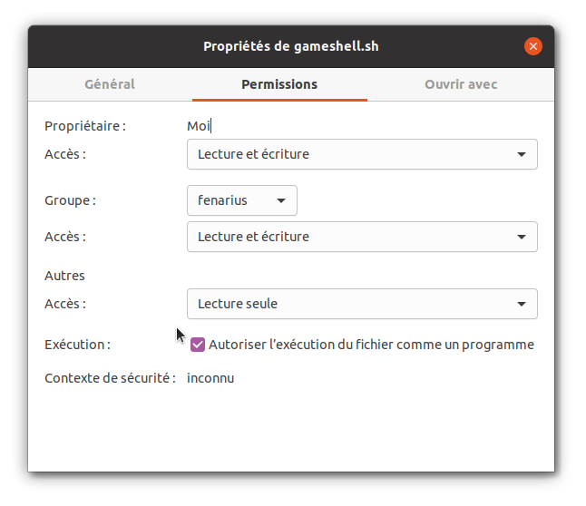
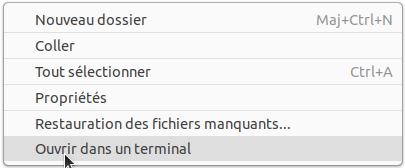
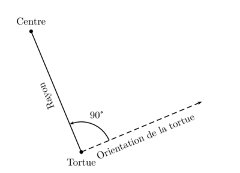
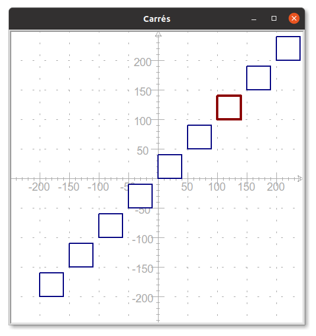







{{ titre_chapitre(num,titre,theme,niveau)}}
 
## Activités 
 
{{ titre_activite("Ligne de commande",[],0) }}

Le but de cette activité est de redécouvrir les bases de la ligne de commande. On utilisera [gameshell](https://github.com/phyver/GameShell){target=_blank}, un mini-jeu d'aventure où les commandes servent à accomplir des missions.

1. Installation de Gameshell :
    1. Télécharger le fichier [gameshell](./files/C0/gameshell.sh).
    2. Ouvrir l'explorateur de fichier.
    3. Créer un répertoire `gameshell` dans votre dossier personnel (en faisant un clic-droit et en sélectionnant *nouveau dossier*)
    4. Dans ce répertoire, copier le fichier gameshell que vous avez téléchargé.
    4. Faire un clic droit sur le fichier et dans l'onglet permission cocher la case '*Autoriser l'exécution du fichier comme un programme*', comme illustré ci-dessous : {: .imgcentre}
    5. Faire un clic droit dans la fenêtre de l'explorateur de fichier et sélectionner "*ouvrir dans un terminal*" comme illustré ci-dessous :{: .imgcentre}
    6. Dans le terminal taper :
    ```bash
     ./gameshell.sh 
    ```

2. Parallèlement à l'exécution des missions :
    * Noter les commandes que vous utilisez et leur signification
    * Tenir à jour un plan du monde dans lequel se déroule le jeu
    
    !!! aide "Aide"
        Pour la première mission, vous devez donc noter le sens des commandes `cd`, `ls` et `pwd` et commencer le schéma suivant qui sera à poursuivre tout au long des missions :
        ```mermaid
            graph TD
            A[Monde] --> B[Chateau]
            A --> C[Echoppe]
            A --> D[Forêt]
            A --> E[Jardin]
            A --> F[Montagne]
        ```

3. L'installation de Gameshell, faite ci-dessus à l'aide de l'interface graphique aurait pu être réalisé en ligne de commande.
    1. Quelle commande permet de créer un répertoire `gameshell` dans votre dossier personnel (question *1.c* ci-dessus) ?
    2. Quelle commande correspond à la copie du fichier (question *1.d* ci-dessus) ?
    3. Quelle commande correspond à la modification des droits d'exécution (question *1.e* ci-dessus) ?

{{ titre_activite("Module `turtle` de Python",[]) }}

Le but de cette activité est de redécouvrir les bases de la programmation en python en utilisant le module `turtle` qui permet de dessiner à l'aide d'une "*tortue*" (équivalente à un crayon) à laquelle on donne des instructions (se déplacer, avancer, tourner, ...) de façon à former le dessin désiré. Cette tortue se déplace sur un écran (équivalent au papier), doté d'un repère comme en mathématiques.

1. Dessiner une grille de morpion <br>
On souhaite dessiner une grille du [jeu de morpion](https://fr.wikipedia.org/wiki/Morpion_(jeu)){target=_blank} comme ci-dessous (où le repère du papier est tracé de façon à connaître les dimensions et positions des traits) :
{: .imgcentre}

    1. Recopier et executer le programme suivant :

        ```python
        import turtle

        # Création du "papier" et du "crayon"
        crayon = turtle.Turtle()
        papier = turtle.Screen()

        # Taille, dimension et couleur pour le papier et le crayon
        papier.bgcolor("beige")
        papier.setup(width=500,height=500)
        crayon.color("navy")
        crayon.pensize(5)

        # Tracé d'un trait avec les coordonnées des extrémités
        crayon.penup()
        crayon.goto(-50,-150)
        crayon.pendown()
        crayon.goto(-50,150)

        # Tracé d'un trait en orientant et en faisant avancer la tortue
        crayon.penup()
        crayon.goto(50,-150)
        crayon.pendown()
        crayon.setheading(90)
        crayon.forward(300)

        # Attends un clic pour fermer la fenêtre de dessin
        papier.exitonclick()
        ```

    2. Expliquer le rôle des instructions suivantes :
        
        * `pensize` et `color`
        * `penup` et `pendown`
        * `goto` et `forward`
        * `setheading`

        !!! Aide
            Vous pouvez modifier les paramètres ou supprimer certaines instructions pour en voir l'effet sur le dessin. Aider vous aussi des commentaires.

    3. Compléter ce programme en traçant les deux traits horizontaux manquants afin de compléter le dessin de la grille de morpion.

2. Dessiner un cercle au centre de la grille de morpion (de rayon 40, de couleur `darkred` avec un crayon d'épaisseur 7) de façon à obtenir le dessin final suivant :
{: .imgcentre}

    !!! Aide
        Utiliser `circle(r)` où `r` est le rayon du cercle à tracer, on fera attention que le centre du cercle se situe toujours à *gauche* de l'orientation de la tortue et à une distance `r` comme représenté ci-dessous :
        {: .imgcentre}

{{ titre_activite("De l'utilité des fonctions",[]) }}

!!! Attention 
    Cette activité est la suite de la précédente, on doit donc déjà disposer d'un programme Python permettant de tracer la grille de morpion ainsi que le cercle central. Même si vous pouvez télécharger ce programme [ici](./files/C0/correction_activite2.py), il est fortement conseillé d'avoir assimilé les notions de l'activité précédente (tracé des lignes et des cercles) avant de continuer.

1. On propose d'écrire une fonction `ligne` permettant de tracer avec la tortue `crayon` un trait en donnant les coordonnées `x1` et `y1` de l'origine et `x2` et `y2` de l'extrémité.
    1. Par quel mot clé commence la définition d'une fonction en Python ?
    2. Quels seront ici les arguments de la fonction ?
    3. Recopier et compléter le code de cette fonction :
    
    ``` python
    ... ligne(..,..,..,..):
        crayon....()
        crayon....(..,..)
        crayon.....()
        crayon.....(..,..)
    ```
    
    4. Ajouter une chaîne de documentation à cette fonction
    5. Faire le tracé de la grille de morpion en vous aidant de cette fonction.
    6. Que peut-on dire par rapport à version du programme qui n'utilisait pas de fonction ?

2. En vous inspirant de l'exemple précédent, écrire une fonction `ligne2` permettant de tracer un trait en donnant les coordonnées `x` et `y` de son origine, ainsi que sa longueur `l` et sa direction `d` (sous la forme d'un angle).

    !!! Aide
        On utilisera `forward` pour avancer de la longueur indiquée et `setheading` pour positionner la tortue avec l'orientation désirée.

3. Ecrire une fonction `cercle` permettant de tracer un cercle dont on donne les coordonnées du centre `x` et `y` et le rayon `r`

4. Ecrire une fonction `croix` qui permet de tracer une croix (:fontawesome-solid-times:) en donnant son centre et la longueur des branches.

{{ titre_activite("Une boucle pour répéter",[]) }}
On souhaite dessiner la grille suivante à l'aide du module `turtle` de Python : 
{: .imgcentre}
On dispose déjà d'un début de programme qui définit les propriétés du papier et du crayon ainsi que  la fonction `ligne` permettant de tracer une ligne en donnant les deux extrémités (voir activités précédentes) :
```python
    import turtle

    # Création du "papier" et du "crayon"
    crayon = turtle.Turtle()
    papier = turtle.Screen()
    # Taille, dimension et couleur pour le papier et le crayon
    papier.bgcolor("beige")
    papier.setup(width=500,height=500)
    crayon.color("navy")
    crayon.pensize(5)

    def ligne(x1,y1,x2,y2):
        crayon.penup()
        crayon.goto(x1,y1)
        crayon.pendown()
        crayon.goto(x2,y2)
```

1. Écrire les instructions permettant de tracer les lignes horizontales.
2. Une (bien) meilleure solution
    1. Vérifier que les instructions suivantes permettent de tracer les lignes verticales :
    ```python
    for abscisse in range(-200,250,50):
        ligne(abscisse,-200,abscisse,200)
    ```
    2. Quelles sont les valeurs prises successives prises par la variable `abscisse` dans le programme précédant ?
    3. Rappeler le rôle des paramètres de `range`

{{ titre_activite("Instructions conditionnelles",[]) }}
On souhaite dessiner la figure suivante à l'aide du module `turtle` de Python : 
{: .imgcentre}

1. Ecrire une fonction `carre(x,y,c)` qui trace le carré de côté `c` dont le coin inférieur gauche a pour coordonnées `(x,y)`.
2. Ecrire une boucle à l'aide d'une instruction `for ... in range(....):` de façon à tracer la suite de carré bleu.
3. Ajouter une instruction conditionnelle dans la boucle de façon à ce que le septième carré soit tracé en rouge et avec un crayon plus épais comme sur la figure.

    !!! Rappel
        On rappelle que la syntaxe d'une instruction conditionnelle est :
        ```python
        if <condition>:
            <instructions1>
        else:
            <instructions2>
        ``` 
        
{{ titre_activite("Le problème de Josephus",["video"]) }}

<div class="centre"><iframe width="560" height="315" src="https://www.youtube.com/embed/uCsD3ZGzMgE" title="YouTube video player" frameborder="0" allow="accelerometer; autoplay; clipboard-write; encrypted-media; gyroscope; picture-in-picture" allowfullscreen></iframe></div>

Le but de l'activité est d'écrire un programme permettant de résoudre le [problème de Joséphus](https://fr.wikipedia.org/wiki/Probl%C3%A8me_de_Jos%C3%A8phe){target=_blank} en révisant les listes de Python.


1. On représente un cercle de `n` soldats par la liste `[1,2,...,n]`
    1. Ecrire une fonction `soldats(n)` qui renvoie la liste `[1,2,....,n]`
    2. Verifier que `n` est bien un entier strictement positif à l'aide d'instruction `assert`
    3. Ajouter une chaîne documentation.
2. Afin de repérer l'épée, on décide que le soldat qui la tient se situe *toujours en première position de la liste*.
    1. Compléter l'évolution de la liste de soldat ci-dessous

        | Etat de la liste | Explications |
        |------------------|--------------|
        |[==1==,~~2~~,3,4,5,6] | `1` élimine `2` et passe l'épée à `3` qui passe donc en tête de liste |
        |[==3==,...,5,6,1]  | `3` élimine `...` et passe l'épée à `...` qui passe donc en tête de liste |
        |[==...==,~~6~~,1,3]  | `...` élimine `...` et passe l'épée à `...` qui passe donc en tête de liste |
        |[...,...,...] | ..... |
        |[...,...] | ..... |
        |[...] | ..... |
    
    2. Compléter l'algorithme suivant d'évolution de la liste et indiquer les instructions Python correspondantes (on désigne par `cercle` la liste représentant le cercle de soldats):

        |Etapes | Opération sur la liste | Instructions Python |
        |-|------------------------|---------------------|
        |:one:| .......... |                  `tueur=cercle.pop(0)`
        |:two:| Ajouter cet élément en fin de liste|        ......    |
        |:three:| Supprimer le premier élément |       ......           |

    3. Quel est la condition d'arrêt de l'algorithme ?
    4. Exprimer cette condition par un test en python sur `cercle`

3. Programmer une fonction `josephus(n)` qui renvoie le soldat survivant pour un cercle de `n` soldats.


## Cours

{{ aff_cours(num) }}


## Exercices


{{ exo("Les bases de la ligne de commande",[],0) }}
1. En utilisant uniquement la  ligne de commande, créer l'arborescence suivante dans votre répertoire personnel :
        ```mermaid
            graph TD
            A[Cours] --> B[C0-Révisions]
            A[Cours] --> G[C1-Récursivité]
            B --> C[Exercices]
            B --> D[Activités]
            B --> E[Notes]
            B --> F[Python]
        ```
2. Renommer le dossier `Cours` en `NSI`
3. Créer un fichier vide `exercice2.txt` dans le dossier `Exercices`

{{ exo("Quelques commandes",[]) }}

1. **Sans les tester**, écrire dans le fichier `exercice2.txt` crée à l'exercice précédent l'effet des commandes suivantes :
    * `cd ~`
    * `mkdir Partage`
    * `chmod a+rwx Partage`
    * `cd Partage`
    * `touch hello.txt`
    * `echo "Salut tout le monde" > hello.txt`
    * `cat hello.txt`

2. Taper ces commandes pour vérifier vos précisions.


{{ exo("Arborescence",[]) }}

1. Rechercher l'aide de la commande `tree`, quel est l'effet de cette commande ?
2. Afficher l'arborescence de votre répertoire personnel
3. Afficher l'arborescence de la racine *en limitant à un la profondeur*
4. Rechercher sur le *Web* le rôle des dossiers suivants :
    * `/etc`
    * `/home`
    * `/dev`
    * `/tmp`

!!! Aide
    Pour les exercices avec `turtle`, on peut consulter [la page de documentation officielle du module](https://docs.python.org/fr/3/library/turtle.html){target=_blank}

{{ exo("Figures géométriques avec Turtle",[]) }}

1. Ecrire une fonction `rectangle(x,y,l1,l2)` qui trace le rectangle de dimensions `l1` $\times$ `l2` et dont le coin inférieur gauche à pour coordonnées `x` et `y`.
2. On peut remplir une surface construite avec un `crayon` du module `turtle` :
    * Spécifier une couleur de remplissage par exemple `crayon.fillcolor(red)`
    * Au début du tracé de la figure écrire l'instruction `crayon.begin_fill()`
    * A la fin du tracé de la figure écrire l'instruction `crayon.end_fill()`

    Modifier votre fonction rectangle de façon à pouvoir tracer un rectangle rempli avec une couleur passée en paramètre.

{{ exo("Quelques figures avec `turtle`",[]) }}
Construire les figures suivantes (le repère est là pour vous aider et ne doit pas être reproduit):

1. L'escalier
{: .imgcentre}
2. Cercles concentriques (les couleurs alternent entre `blue` et `lightblue`, le crayon a une épaisseur de 10, les cercles ont pour rayon 10,20,30, ...)
{: .imgcentre}


{{ exo("Pour réviser les listes",[]) }}
1. On considère le programme suivant :

    ```python
        liste1 = [0]*100
        liste2 = [0 for k in range(100)]
        liste3 = []
        for k in range(100):
            liste3.append(0)
    ```

    2. Quel est le contenu de chacune des listes ?
    3. Indiquer par quel procédé chacune de ces listes a été crée.

2. Ecrire un programme python permettant de créer les listes suivantes :
    1. Une liste contenant 12 fois le chiffre 7.
    2. La liste des nombres entiers de 1 à 100.
    3. Une liste contenant 1000 nombres tirés au sort entre 1 et 6. \\

        !!! aide 
            On rappelle que la fonction `randint` peut être importée depuis le module `random`, elle permet de tirer un nombre au hasard entre deux valeurs `a` et `b` donnés en paramètres.

    4. La liste des cubes des entiers de 1 à 10.

{{ exo("Parcours de liste",[]) }}
1. Ecrire une fonction `somme(l)` qui renvoie la somme des éléments de la liste `l`. Vérifier que tous les éléments de `l` sont biens des nombres entiers (`int`) ou flottants (`float`).
2. Ecrire une fonction `indice(elt,l)` qui renvoie l'indice de la première apparition de `elt` si `elt` est dans `l` et $-1$ sinon.

    !!! Example "Exemples"
        * `indice(3,[1,2,3,5,7,11])` renvoie `2` puisque `3` est dans cette liste à l'indice 2.
        * `indice(13,[1,2,3,5,7,11])` renvoie `-1` puisque `13` n'est pas dans cette liste.

{{ exo("Polygone régulier",["maths"]) }}

1. Ecrire une fonction `triangle_equilateral(c)` qui trace un triangle équilatéral de côte `c` à partir de la position courante de la tortue.
2. Ecrire une fonction `carre(c)` qui trace un carré de côte `c` à partir de la position courante de la tortue.
3. Ecrire une fonction `polygone_regulier(n,c)` qui trace un polygone régulier de côte `c` à partir de la position courante de la tortue.
    
    !!! Rappel
 
        * Un polygone régulier est un polygone dont tous les côtés sont de la même longueur et tous les angles sont égaux.
        * Les angles d'un polygone régulier à $n$ côtés mesurent $\dfrac{360}{n}$


{{ exo("Panneau de signalisation",[]) }}
Ecrire un programme Python permettant de dessiner le panneau de signalisation de votre choix. Quelques exemples sont proposés ci-dessous.<br>
{width=150px} &nbsp;
{width=150px}  &nbsp;
{width=150px}  &nbsp;
{width=150px} 