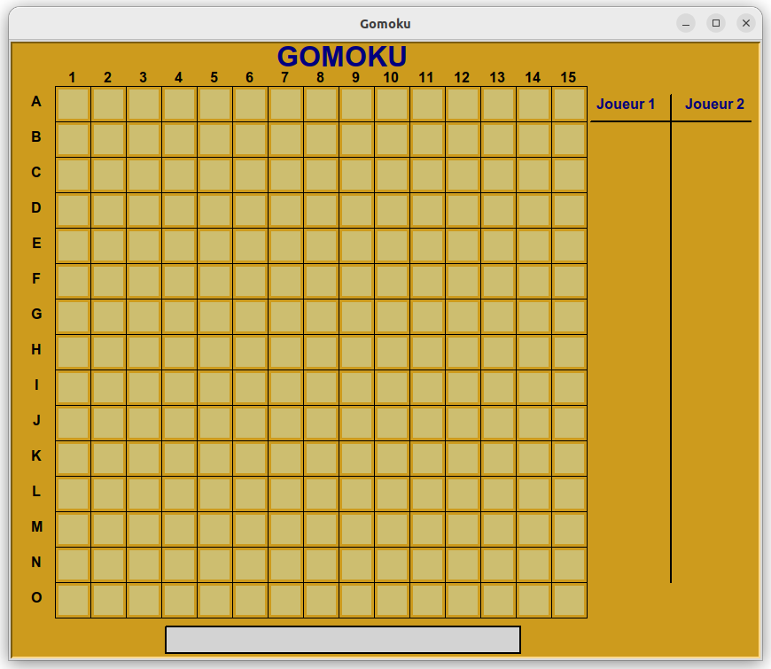
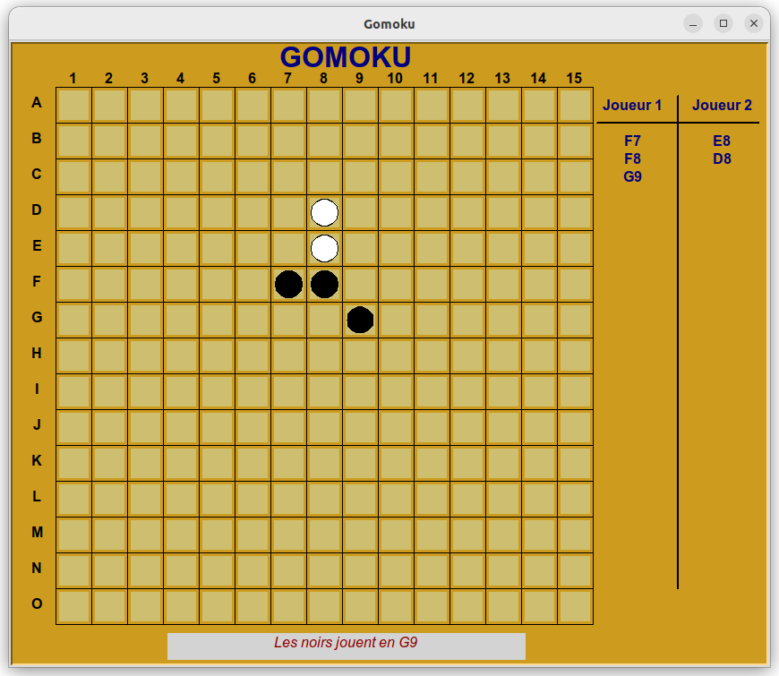
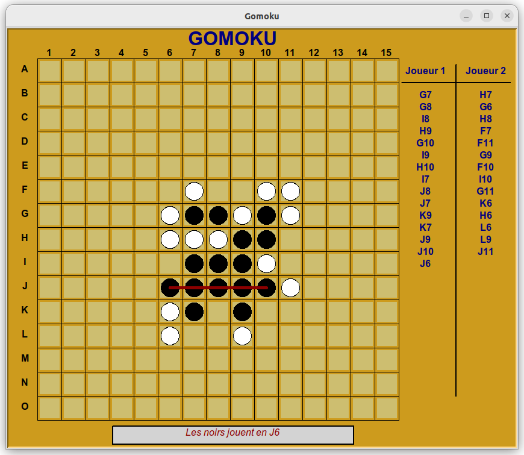

## Gomoku

Dans le jeu de Gomoku (voir illustration ci-dessous) deux joueurs s'affrontent dans le but d'aligner en premier  5 pions dans n'importe quelle direction (horizontale, verticale, diagonale). Traditionnellement, ce jeu se joue sur un plateau du [jeu de Go](https://fr.wikipedia.org/wiki/Go_(jeu)){target=_blank} de dimensions 15 sur 15 (ou 19 sur 19) avec des pions noirs et blancs pour chacun des deux joueurs.
<div class="centre"><a title="Matěj Baťha, CC BY-SA 3.0 &lt;http://creativecommons.org/licenses/by-sa/3.0/&gt;, via Wikimedia Commons" href="https://commons.wikimedia.org/wiki/File:Renju.jpg"></a></div>
On pourra consulter [la page wikipedia consacrée à ce jeu](https://en.wikipedia.org/wiki/Gomoku){target=_blank} pour plus d'informations.

Le but du projet est de programmer ce jeu en python afin que deux joueurs humains puissent s'affronter dans une interface graphique réalisée avec le module `turtle`.

### Etape 1 : réalisation du plateau de jeu
Dessiner la grille de jeu, prévoir un espace pour l'affichage de message pendant le jeu et pour l'affichage des coups des joueurs. Un exemple est donnée ci-dessous :
{.imgcentre width=600px}
Sur cet exemple, on a prévu deux colonnes à droites pour indiquer les coups successifs des joueurs ainsi qu'un cadre gris en bas pour afficher les messages durant la partie (coup invalide, victoire, ...). 

!!! aide
    Pour faciliter le positionnement des différents éléments, on peut au préalable dessiner le repère de la tortue en version papier et y positionner les différents éléments afin d'avoir directement leurs coordonnées.

A la fin de cette étape on devrait donc disposer d'une fonction `dessine_jeu` qui dessine tous les éléments du jeu tels que ci-dessus.

### Etape 2 : positionner un pion sur la grille

Le but de cet étape est d'écrire :

* une fonction `dessine_pion` qui prend en paramètre le numéro de ligne et de colonne ainsi que le numéro du coup joué a le dessine à l'emplacement correspondant sur la grille. Par exemple `dessine_pion(5,6,1)` dessine le pion situé en F7 (on numérote à partir de zéro comme les listes de Python) de couleur noir (c'est le premier coup joué et les noirs commencent).
* une fonction `note_coup` qui note dans l'emplacement prévu dans les colonnes de droite le coup du joueur concerné. Par exemple, `note_coup(4,7,2)` écrit dans la colonne du joueur 2 `E8`. Cette fonction sera appelée par `dessine_pion`, de façon à ce que dessiner un pion écrive en même temps le coup joué.
* une fonction `message` qui écrit dans le cadre prévu sur le plateau de jeu le coup du joueur concerné. Cette fonction peut être appelée par la fonction `note_coup` ci-dessus.

!!! aide
    On pourra écrire une fonction `position_pion` qui prend en argument un ligne et une colonne et renvoie la position du centre du pion dans la grille. Par exemple `position_pion(5,6)` doit renvoyer l'abscisse et l'ordonnée du centre de la case `F7`.
    
Dans l'illustration ci-dessous, on a testé nos fonctions en écrivant dans le programme principal :
```python
dessine_jeu()
dessine_pion(5,6,1)
dessine_pion(4,7,2)
dessine_pion(5,7,3)
dessine_pion(3,7,4)
dessine_pion(6,8,5)
```

{.imgcentre width=600px}


### Etape 3 : boucle principale du jeu et gestion des interactions avec les joueurs

Le but de cette étape est d'écrire la boucle principale du jeu ainsi qu'une fonction `joue_coup` qui fait apparaître une fenêtre `textinput` du module turtle pour qu'un joueur y entre son coup sous la forme d'un lettre pour la ligne (de `A` à `O`) et d'un nombre (de `1` à `15`) pour la colonne puis de valider ce coup avant de le jouer.
Un coup est valide lorsqu'il se situe sur la grille et que la case n'est pas *encore occupée*. On tiendra donc à jour une variable `grille` contenant l'état du plateau de jeu. On pourra *par exemple*, utiliser une liste de listes, chaque liste représentant une des lignes du plateau de jeu et considérer que dans ces listes :

* un 0 représente une case vide
* un 1 représente un pion du joueur 1
* un 2 représente un pion du joueur 2

Au départ le plateau de jeu étant vide, `grille` est la liste dont chaque élément est une liste de 15 zéros. Si on tape `F7` dans `joue_coup` le sixième élément de `grille` devient la liste `[0,0,0,0,0,0,1,0,0,0,0,0,0,0,0]`. Si le joueur 2 joue ensuite en `F8` cette liste devient `[0,0,0,0,0,0,1,2,0,0,0,0,0,0,0]`

Pour la boucle principale du jeu, on considère pour simplifier que le jeu s'arrête dès qu'un des joueurs aligne cinq pions. On peut donc créer une variable booléenne `victoire` initialisée à `False` et écrire une boucle `while not victoire`. Dans cette boucle, on fait appel aux fonctions écrites plus haut, pour jouer les coups successifs de chacun des joueurs et on met à jour une variable comptabilisant le nombre de coups joués.

### Etape 4 : tester si cinq pions sont alignés

Le but de cette étape est d'écrire une fonction `victoire` qui prend en argument une grille de jeu et renvoie `True` si dans cette grille 5 pions sont alignés et `False` sinon. Lorsqu'un alignement de 5 pions est repérée, cette fonction tracera aussi une ligne rouge sur les pions afin de rendre bien visible l'alignement.

!!! aide
    On pourra commencer par chercher les alignements de 5 pions seulement  en horizontal puis en vertical et enfin en diagonale afin d'avoir toutes les possibilités de victoire.

On montre ci-dessous un exemple de partie où les noirs sont victorieux :
{.imgcentre width=600px}


A la fin de cette étape, on dispose donc d'un programme fonctionnel permettant à deux joueurs de s'affronter.

### Etape 5 : aller plus loin

Cette étape consiste à améliorer le jeu plusieurs pistes sont proposées :

* pouvoir jouer à la souris (pour cela utiliser la fonction `onclick` du module turtle associé à `mainloop`)
* pouvoir revenir en arrière de un ou plusieurs coups dans la partie
* pouvoir sauvegarder (et donc charger) une partie en cours
* pouvoir choisir les couleurs, formes de pions, ...
* pouvoir choisir les couleurs, formes de pions, ...

## POO et réseau

Le but du projet est la réalisation d'un programme permettant de gérer et traiter les adresses {{sc("ip")}} et les masques de sous réseau en utilisant la programmation orientée objet. De nombreux exercices de baccalauréat à l'épreuve écrite incluent des questions du type :
* déterminer le nombre de machines pouvant être connectées à un réseau,
* convertir des adresses en binaire vers du décimal ou inversement,
* déterminer l'adresse d'un réseau à partir de l'adresse d'une machine et du masque, ...
Après une révision de ces notions, on écrira un programme Python permettant de traiter ces questions.

### Etape 1 : notions de réseau

### Etape 2 : classe des adresses IP

### Etape 3 : classe des masques de sous réseau

### Etape 4 : écriture de quelques méthodes

### Etape 5 : pour aller plus loin
